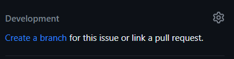
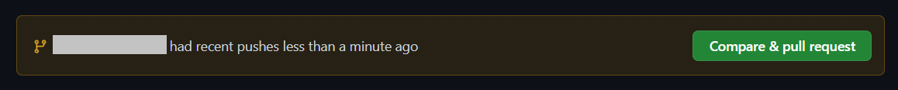

Thank you for investing your time in contributing to the project! Any contribution you make will be reflected in the most recent version of distilabel 🤩.

??? Question "New to contributing in general?"
    If you're a new contributor, read the [README](https://github.com/argilla-io/distilabel/blob/develop/README.md) to get an overview of the project. In addition, here are some resources to help you get started with open-source contributions:

    * **Discord**: You are welcome to join the [distilabel Discord community](http://hf.co/join/discord), where you can keep in touch with other users, contributors and the distilabel team. In the following [section](#first-contact-in-discord), you can find more information on how to get started in Discord.
    * **Git**: This is a very useful tool to keep track of the changes in your files. Using the command-line interface (CLI), you can make your contributions easily. For that, you need to have it [installed and updated](https://git-scm.com/book/en/v2/Getting-Started-Installing-Git) on your computer.
    * **GitHub**: It is a platform and cloud-based service that uses git and allows developers to collaborate on projects. To contribute to distilabel, you'll need to create an account. Check the [Contributor Workflow with Git and Github](#contributor-workflow-with-git-and-github) for more info.
    * **Developer Documentation**: To collaborate, you'll need to set up an efficient environment. Check the [Installation](../getting_started/installation.md) guide to know how to do it.

## First Contact in Discord

Discord is a handy tool for more casual conversations and to answer day-to-day questions. As part of Hugging Face, we have set up some distilabel channels on the server. Click [here](http://hf.co/join/discord) to join the Hugging Face Discord community effortlessly.

When part of the Hugging Face Discord, you can select "Channels & roles" and select "Argilla" along with any of the other groups that are interesting to you. "Argilla" will cover anything about argilla and distilabel. You can join the following channels:

* **#argilla-distilabel-announcements**: 📣 Stay up-to-date.
* **#argilla-distilabel-general**: 💬 For general discussions.
* **#argilla-distilabel-help**: 🙋‍♀️ Need assistance? We're always here to help. Select the appropriate label (argilla or distilabel) for your issue and post it.

So now there is only one thing left to do: introduce yourself and talk to the community. You'll always be welcome! 🤗👋


## Contributor Workflow with Git and GitHub

If you're working with distilabel and suddenly a new idea comes to your mind or you find an issue that can be improved, it's time to actively participate and contribute to the project!

### Report an issue

If you spot a problem, [search if an issue already exists](https://github.com/argilla-io/distilabel/issues?q=is%3Aissue), you can use the `Label` filter. If that is the case, participate in the conversation. If it does not exist, create an issue by clicking on `New Issue`. This will show various templates; choose the one that best suits your issue. Once you choose one, you will need to fill it in following the guidelines. Try to be as clear as possible. In addition, you can assign yourself to the issue and add or choose the right labels. Finally, click on `Submit new issue`.


### Work with a fork

#### Fork the distilabel repository

After having reported the issue, you can start working on it. For that, you will need to create a fork of the project. To do that, click on the `Fork` button. Now, fill in the information. Remember to uncheck the `Copy develop branch only` if you are going to work in or from another branch (for instance, to fix documentation, the `main` branch is used). Then, click on `Create fork`.

You will be redirected to your fork. You can see that you are in your fork because the name of the repository will be your `username/distilabel`, and it will indicate `forked from argilla-io/distilabel`.


#### Clone your forked repository

In order to make the required adjustments, clone the forked repository to your local machine. Choose the destination folder and run the following command:

```sh
git clone https://github.com/[your-github-username]/distilabel.git
cd distilabel
```

To keep your fork’s main/develop branch up to date with our repo, add it as an upstream remote branch.

```sh
git remote add upstream https://github.com/argilla-io/distilabel.git
```


### Create a new branch

For each issue you're addressing, it's advisable to create a new branch. GitHub offers a straightforward method to streamline this process.

> ⚠️ Never work directly on the `main` or `develop` branch. Always create a new branch for your changes.

Navigate to your issue, and on the right column, select `Create a branch`.



After the new window pops up, the branch will be named after the issue and include a prefix such as feature/, bug/, or docs/ to facilitate quick recognition of the issue type. In the `Repository destination`, pick your fork ( [your-github-username]/distilabel), and then select `Change branch source` to specify the source branch for creating the new one. Complete the process by clicking `Create branch`.

> 🤔 Remember that the `main` branch is only used to work with the documentation. For any other changes, use the `develop` branch.

Now, locally, change to the new branch you just created.

```sh
git fetch origin
git checkout [branch-name]
```

### Make changes and push them

Make the changes you want in your local repository, and test that everything works and you are following the guidelines.

Once you have finished, you can check the status of your repository and synchronize with the upstreaming repo with the following command:

```sh
# Check the status of your repository
git status

# Synchronize with the upstreaming repo
git checkout [branch-name]
git rebase [default-branch]
```

If everything is right, we need to commit and push the changes to your fork. For that, run the following commands:

```sh
# Add the changes to the staging area
git add filename

# Commit the changes by writing a proper message
git commit -m "commit-message"

# Push the changes to your fork
git push origin [branch-name]
```

When pushing, you will be asked to enter your GitHub login credentials. Once the push is complete, all local commits will be on your GitHub repository.


### Create a pull request

Come back to GitHub, navigate to the original repository where you created your fork, and click on `Compare & pull request`.



First, click on `compare across forks` and select the right repositories and branches.

> In the base repository, keep in mind that you should select either `main` or `develop` based on the modifications made. In the head repository, indicate your forked repository and the branch corresponding to the issue.

Then, fill in the pull request template. You should add a prefix to the PR name, as we did with the branch above. If you are working on a new feature, you can name your PR as `feat: TITLE`. If your PR consists of a solution for a bug, you can name your PR as `bug: TITLE`. And, if your work is for improving the documentation, you can name your PR as `docs: TITLE`.

In addition, on the right side, you can select a reviewer (for instance, if you discussed the issue with a member of the team) and assign the pull request to yourself. It is highly advisable to add labels to PR as well. You can do this again by the labels section right on the screen. For instance, if you are addressing a bug, add the `bug` label, or if the PR is related to the documentation, add the `documentation` label. This way, PRs can be easily filtered.

Finally, fill in the template carefully and follow the guidelines. Remember to link the original issue and enable the checkbox to allow maintainer edits so the branch can be updated for a merge. Then, click on `Create pull request`.

For the PR body, ensure you give a description of what the PR contains, and add examples if possible (and if they apply to the contribution) to help with the review process. You can take a look at [#PR 974](https://github.com/argilla-io/distilabel/pull/974) or [#PR 983](https://github.com/argilla-io/distilabel/pull/983) for examples of typical PRs.


### Review your pull request

Once you submit your PR, a team member will review your proposal. We may ask questions, request additional information, or ask for changes to be made before a PR can be merged, either using [suggested changes](https://docs.github.com/en/github/collaborating-with-issues-and-pull-requests/incorporating-feedback-in-your-pull-request) or pull request comments.

You can apply the changes directly through the UI (check the files changed and click on the right-corner three dots; see image below) or from your fork, and then commit them to your branch. The PR will be updated automatically, and the suggestions will appear as `outdated`.


> If you run into any merge issues, check out this [git tutorial](https://github.com/skills/resolve-merge-conflicts) to help you resolve merge conflicts and other issues.


### Your PR is merged!

Congratulations 🎉🎊 We thank you 🤩

Once your PR is merged, your contributions will be publicly visible on the [distilabel GitHub](https://github.com/argilla-io/distilabel#contributors).

Additionally, we will include your changes in the next release based on our [development branch](https://github.com/argilla-io/argilla/tree/develop).

## Additional resources

Here are some helpful resources for your reference.

* [Configuring Discord](https://support.discord.com/hc/en-us/categories/115000217151), a guide to learning how to get started with Discord.
* [Pro Git](https://git-scm.com/book/en/v2), a book to learn Git.
* [Git in VSCode](https://code.visualstudio.com/docs/sourcecontrol/overview), a guide to learning how to easily use Git in VSCode.
* [GitHub Skills](https://skills.github.com/), an interactive course for learning GitHub.