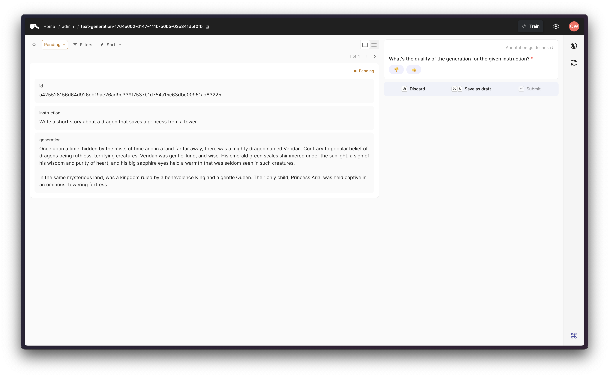
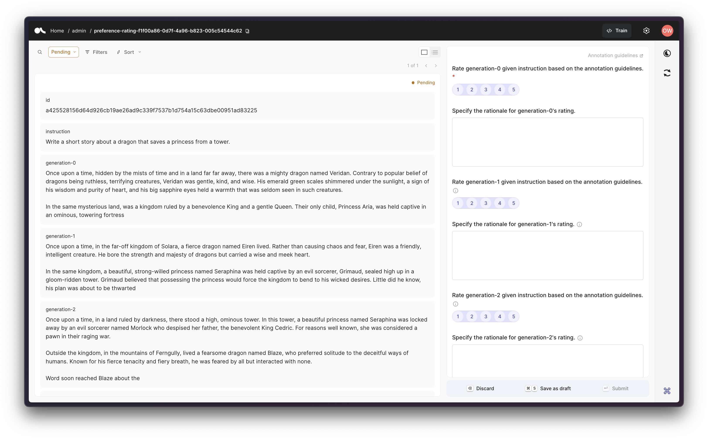

# Export data to Argilla

Being able to export the generated synthetic datasets to Argilla, is a core feature within `distilabel`. We believe in the potential of synthetic data, but without removing the impact a human annotator or group of annotators can bring. So on, the Argilla integration makes it straightforward to push a dataset to Argilla while the [`Pipeline`][distilabel.pipeline.Pipeline] is running, to be able to follow along the generation process in Argilla's UI, as well as annotating the records on the fly. One can include a [`Step`][distilabel.steps.Step] within the [`Pipeline`][distilabel.pipeline.Pipeline] to easily export the datasets to Argilla with a pre-defined configuration, suiting the annotation purposes.

Before using any of the steps about to be described below, you should first have an Argilla instance up and running, so that you can successfully upload the data to Argilla. In order to deploy Argilla, the easiest and most straightforward way is to deploy it via the [Argilla Template in Hugging Face Spaces](https://huggingface.co/docs/hub/en/spaces-sdks-docker-argilla) as simply as following the steps there, or just via the following button:

<a  href="https://huggingface.co/new-space?template=argilla/argilla-template-space">
    
</a>


### Text Generation

For text generation scenarios, i.e. when the [`Pipeline`][distilabel.pipeline.Pipeline] contains a single [`TextGeneration`][distilabel.steps.tasks.TextGeneration] step, we have designed the task [`TextGenerationToArgilla`][distilabel.steps.TextGenerationToArgilla], which will seamlessly push the generated data to Argilla, and allow the annotator to review the records.

The dataset will be pushed with the following configuration:

- **Fields**: `instruction` and `generation`, both being fields of type `argilla.TextField`, plus the automatically generated `id` for the given `instruction` to be able to search for other records with the same `instruction` in the dataset. The field `instruction` must always be a string, while the field `generation` can either be a single string or a list of strings (useful when there are multiple parent nodes of type [`TextGeneration`][distilabel.steps.tasks.TextGeneration]); even though each record will always contain at most one `instruction`-`generation` pair.

- **Questions**: `quality` will be the only question for the annotators to answer, i.e., to annotate, and it will be an `argilla.LabelQuestion` referring to the quality of the provided generation for the given instruction. It can be annotated as either 👎 (bad) or 👍 (good).

!!! NOTE
    The [`TextGenerationToArgilla`][distilabel.steps.TextGenerationToArgilla] step will only work as is if the [`Pipeline`][distilabel.pipeline.Pipeline] contains one or multiple [`TextGeneration`][distilabel.steps.tasks.TextGeneration] steps, or if the columns `instruction` and `generation` are available within the batch data. Otherwise, the variable `input_mappings` will need to be set so that either both or one of `instruction` and `generation` are mapped to one of the existing columns in the batch data.

```python
from distilabel.models import OpenAILLM
from distilabel.steps import LoadDataFromDicts, TextGenerationToArgilla
from distilabel.steps.tasks import TextGeneration


with Pipeline(name="my-pipeline") as pipeline:
    load_dataset = LoadDataFromDicts(
        name="load_dataset",
        data=[
            {
                "instruction": "Write a short story about a dragon that saves a princess from a tower.",
            },
        ],
    )

    text_generation = TextGeneration(
        name="text_generation",
        llm=OpenAILLM(model="gpt-4"),
    )

    to_argilla = TextGenerationToArgilla(
        dataset_name="my-dataset",
        dataset_workspace="admin",
        api_url="<ARGILLA_API_URL>",
        api_key="<ARGILLA_API_KEY>",
    )

    load_dataset >> text_generation >> to_argilla

pipeline.run()
```



### Preference

For preference scenarios, i.e. when the [`Pipeline`][distilabel.pipeline.Pipeline] contains multiple [`TextGeneration`][distilabel.steps.tasks.TextGeneration] steps, we have designed the task [`PreferenceToArgilla`][distilabel.steps.PreferenceToArgilla], which will seamlessly push the generated data to Argilla, and allow the annotator to review the records.

The dataset will be pushed with the following configuration:

- **Fields**: `instruction` and `generations`, both being fields of type `argilla.TextField`, plus the automatically generated `id` for the given `instruction` to be able to search for other records with the same `instruction` in the dataset. The field `instruction` must always be a string, while the field `generations` must be a list of strings, containing the generated texts for the given `instruction` so that at least there are two generations to compare. Other than that, the number of `generation` fields within each record in Argilla will be defined by the value of the variable `num_generations` to be provided in the [`PreferenceToArgilla`][distilabel.steps.PreferenceToArgilla] step.

- **Questions**: `rating` and `rationale` will be the pairs of questions to be defined per each generation i.e. per each value within the range from 0 to `num_generations`, and those will be of types `argilla.RatingQuestion` and `argilla.TextQuestion`, respectively. Note that only the first pair of questions will be mandatory, since only one generation is ensured to be within the batch data. Additionally, note that the provided ratings will range from 1 to 5, and to mention that Argilla only supports values above 0.

!!! NOTE
    The [`PreferenceToArgilla`][distilabel.steps.PreferenceToArgilla] step will only work if the [`Pipeline`][distilabel.pipeline.Pipeline] contains multiple [`TextGeneration`][distilabel.steps.tasks.TextGeneration] steps, or if the columns `instruction` and `generations` are available within the batch data. Otherwise, the variable `input_mappings` will need to be set so that either both or one of `instruction` and `generations` are mapped to one of the existing columns in the batch data.

!!! NOTE
    Additionally, if the [`Pipeline`][distilabel.pipeline.Pipeline] contains an [`UltraFeedback`][distilabel.steps.tasks.UltraFeedback] step, the `ratings` and `rationales` will also be available and be automatically injected as suggestions to the existing dataset.

```python
from distilabel.models import OpenAILLM
from distilabel.steps import LoadDataFromDicts, PreferenceToArgilla
from distilabel.steps.tasks import TextGeneration


with Pipeline(name="my-pipeline") as pipeline:
    load_dataset = LoadDataFromDicts(
        name="load_dataset",
        data=[
            {
                "instruction": "Write a short story about a dragon that saves a princess from a tower.",
            },
        ],
    )

    text_generation = TextGeneration(
        name="text_generation",
        llm=OpenAILLM(model="gpt-4"),
        num_generations=4,
        group_generations=True,
    )

    to_argilla = PreferenceToArgilla(
        dataset_name="my-dataset",
        dataset_workspace="admin",
        api_url="<ARGILLA_API_URL>",
        api_key="<ARGILLA_API_KEY>",
        num_generations=4,
    )

    load_dataset >> text_generation >> to_argilla

if __name__ == "__main__":
    pipeline.run()
```


