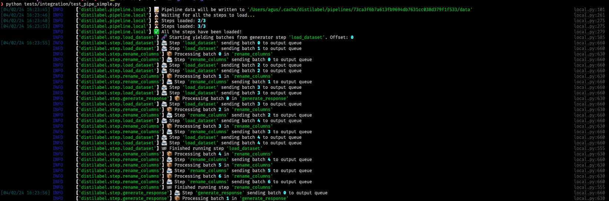
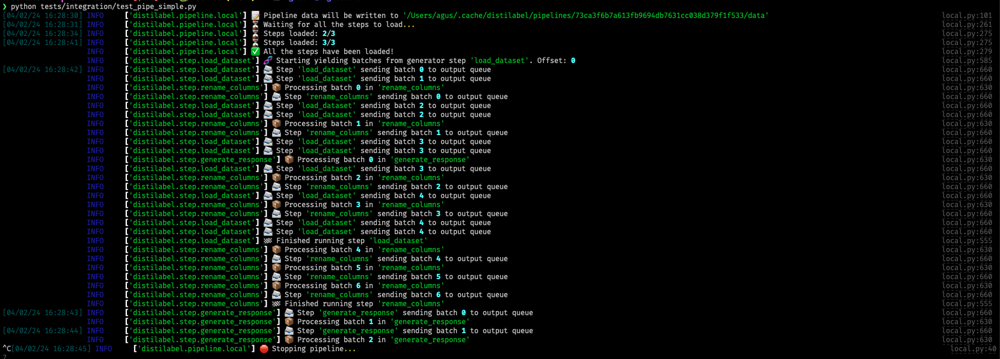
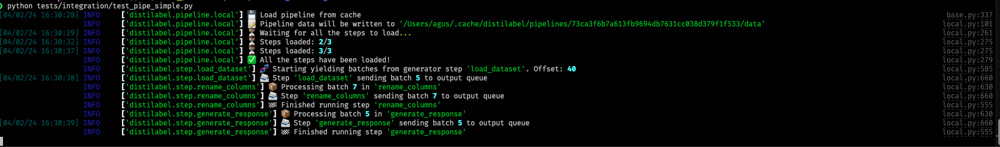
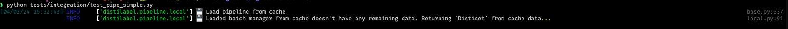

# Cache and recover pipeline executions

Distilabel `Pipelines` automatically save all the intermediate steps to to avoid losing any data in case of error.

## Cache directory

Out of the box, the `Pipeline` will use the `~/.cache/distilabel/pipelines` directory to store the different pipelines[^1]:

```python
from distilabel.pipeline.local import Pipeline

with Pipeline(name="cache_testing") as pipeline:
    ...
```

This directory can be modified by setting the `DISTILABEL_CACHE_DIR` environment variable (`export DISTILABEL_CACHE_DIR=my_cache_dir`) or by explicitly passing the `cache_dir` variable to the `Pipeline` constructor like so:

```python
with Pipeline(name="cache_testing", cache_dir="~/my_cache_dir") as pipeline:
    ...
```

[^1]:

    The pipelines will be organized according to the pipeline's name attribute, and then by the hash, in case you want to look for something manually, like the following example:

    ```bash
    $ tree ~/.cache/distilabel/pipelines/
    ├── cache_testing
    │   └── 13da04d2cc255b2180d6bebb50fb5be91124f70d
    │       ├── batch_manager.json
    │       ├── batch_manager_steps
    │       │   └── succeed_always_0.json
    │       ├── data
    │       │   └── succeed_always_0
    │       │       └── 00001.parquet
    │       ├── pipeline.log
    │       └── pipeline.yaml
    └── test-pipe
        └── f23b95d7ad4e9301a70b2a54c953f8375ebfcd5c
            ├── batch_manager.json
            ├── batch_manager_steps
            │   └── text_generation_0.json
            ├── data
            │   └── text_generation_0
            │       └── 00001.parquet
            ├── pipeline.log
            └── pipeline.yaml
    ```

## How does it work?

Let's take a look at the logging messages from a sample pipeline.

When we run a `Pipeline` for the first time



If we decide to stop the pipeline (say we kill the run altogether via `CTRL + C` or `CMD + C` in *macOS*), we will see the signal sent to the different workers:



After this step, when we run again the pipeline, the first log message we see corresponds to "Load pipeline from cache", which will restart processing from where it stopped:



Finally, if we decide to run the same `Pipeline` after it has finished completely, it won't start again but resume the process, as we already have all the data processed:



### Serialization

Let's see what gets serialized by looking at a sample `Pipeline`'s cached folder:

```bash
$ tree ~/.cache/distilabel/pipelines/73ca3f6b7a613fb9694db7631cc038d379f1f533
├── batch_manager.json
├── batch_manager_steps
│   ├── generate_response.json
│   └── rename_columns.json
├── data
│   └── generate_response
│       ├── 00001.parquet
│       └── 00002.parquet
└── pipeline.yaml
```

The `Pipeline` will have a signature created from the arguments that define it so we can find it afterwards, and the contents are the following:

- `batch_manager.json`

    Folder that stores the content of the internal batch manager to keep track of the data. Along with the `batch_manager_steps/` they store the information to restart the `Pipeline`. One shouldn't need to know about it.

- `pipeline.yaml`

    This file contains a representation of the `Pipeline` in *YAML* format. If we push a `Distiset` to the Hugging Face Hub as obtained from calling `Pipeline.run`, this file will be stored at our datasets' repository, allowing to reproduce the `Pipeline` using the `CLI`:

    ```bash
    distilabel pipeline run --config "path/to/pipeline.yaml"
    ```

- `data/`

    Folder that stores the data generated, with a special folder to keep track of each `leaf_step` separately. We can recreate a `Distiset` from the contents of this folder (*Parquet* files), as we will see next.

- `pipeline.log`

    This file stores the logs that the `Pipeline` generated while processing. Just as with the `pipeline.yaml` file, it will be pushed to the Hugging Face Hub datasets` repository to keep track of the information.

## create_distiset

In case we wanted to regenerate the dataset from the `cache`, we can do it using the [`create_distiset`][distilabel.distiset.create_distiset] function and passing the path to the `/data` folder inside our `Pipeline`:

```python
from pathlib import Path
from distilabel.distiset import create_distiset

path = Path("~/.cache/distilabel/pipelines/73ca3f6b7a613fb9694db7631cc038d379f1f533/data")
ds = create_distiset(path)
ds
# Distiset({
#     generate_response: DatasetDict({
#         train: Dataset({
#             features: ['instruction', 'response'],
#             num_rows: 80
#         })
#     })
# })
```

!!! Note

    Internally, the function will try to inject the `pipeline_path` variable if it's not passed via argument, assuming it's in the parent directory of the current one, called `pipeline.yaml`. If the file doesn't exist, it won't raise any error, but take into account that if the `Distiset` is pushed to the Hugging Face Hub, the `pipeline.yaml` won't be generated. The same happens with the `pipeline.log` file, it can be passed via `log_filename_path`, but it will try to locate it automatically.

    Lastly, there is the option of including the `distilabel_metadata` column in the final dataset. This column can contain custom metadata generated automatically by the pipeline, like the raw output from an `LLM` without formatting in case of failure, and we can decide whether to include it using the `enable_metadata` argument.
