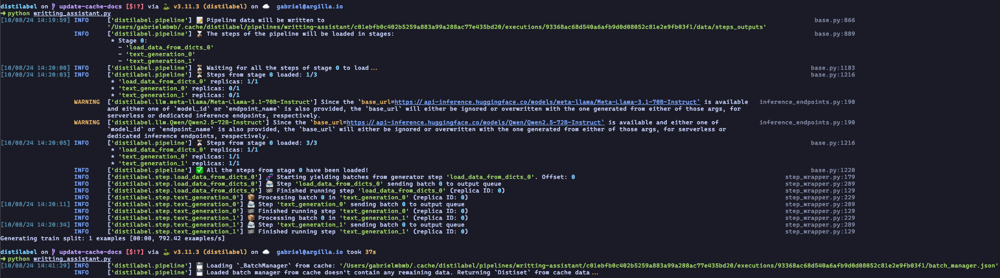
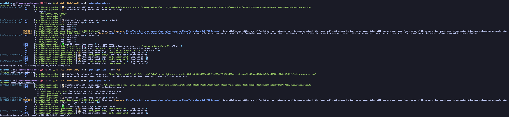

# Pipeline cache

`distilabel` will automatically save all the intermediate outputs generated by each [`Step`][distilabel.steps.base.Step] of a [`Pipeline`][distilabel.pipeline.local.Pipeline], so these outputs can be reused to recover the state of a pipeline execution that was stopped before finishing or to not have to re-execute steps from a pipeline after adding a new downstream step.

## How to enable/disable the cache

The use of the cache can be toggled using the `use_cache` parameter of the [`Pipeline.use_cache`][distilabel.pipeline.base.BasePipeline.run] method. If `True`, then `distilabel ` will use the reuse the outputs of previous executions for the new execution. If `False`, then `distilabel` will re-execute all the steps of the pipeline to generate new outputs for all the steps.

```python
with Pipeline(name="my-pipeline") as pipeline:
    ...

if __name__ == "__main__":
    distiset = pipeline.run(use_cache=False)  # (1)
```

1. Pipeline cache is disabled

In addition, the cache can be enabled/disabled at [`Step`][distilabel.steps.base.Step] level using its `use_cache` attribute. If `True`, then the outputs of the step will be reused in the new pipeline execution. If `False`, then the step will be re-executed to generate new outputs. If the cache of one step is disabled and the outputs have to be regenerated, then the outputs of the steps that depend on this step will also be regenerated.

```python
with Pipeline(name="writting-assistant") as pipeline:
    load_data = LoadDataFromDicts(
        data=[
            {
                "instruction": "How much is 2+2?"
            }
        ]
    )

    generation = TextGeneration(
        llm=InferenceEndpointsLLM(
            model_id="Qwen/Qwen2.5-72B-Instruct",
            generation_kwargs={
                "temperature": 0.8,
                "max_new_tokens": 512,
            },
        ),
        use_cache=False  # (1)
    )

    load_data >> generation

if __name__ == "__main__":
    distiset = pipeline.run()
```

1. Step cache is disabled and every time the pipeline is executed, this step will be re-executed

## How a cache hit is triggered

`distilabel` groups information and data generated by a `Pipeline` using the name of the pipeline, so the first factor that triggers a cache hit is the name of the pipeline. The second factor, is the [`Pipeline.signature`][distilabel.pipeline.local.Pipeline.signature] property. This property returns a hash that is generated using the names of the steps used in the pipeline and their connections. The third factor, is the [`Pipeline.aggregated_steps_signature`][distilabel.pipeline.local.Pipeline.aggregated_steps_signature] property which is used to determine if the new pipeline execution is exactly the same as one of the previous i.e. the pipeline contains exactly the same steps, with exactly the same connections and the steps are using exactly the same parameters. If these three factors are met, then the cache hit is triggered and the pipeline won't get re-executed and instead the function [`create_distiset`][distilabel.distiset.create_distiset] will be used to create the resulting [`Distiset`][distilabel.distiset.Distiset] using the outputs of the previous execution, as it can be seen in the following image:



If the new pipeline execution have a different `Pipeline.aggregated_steps_signature` i.e. at least one step has changed its parameters, `distilabel` will reuse the outputs of the steps that have not changed and re-execute the steps that have changed, as it can be seen in the following image:



The same pipeline from above gets executed a third time, but this time the last step `text_generation_1` changed, so it's needed to re-execute it. The other steps, as they have not been changed, doesn't need to be re-executed and their outputs are reused.
