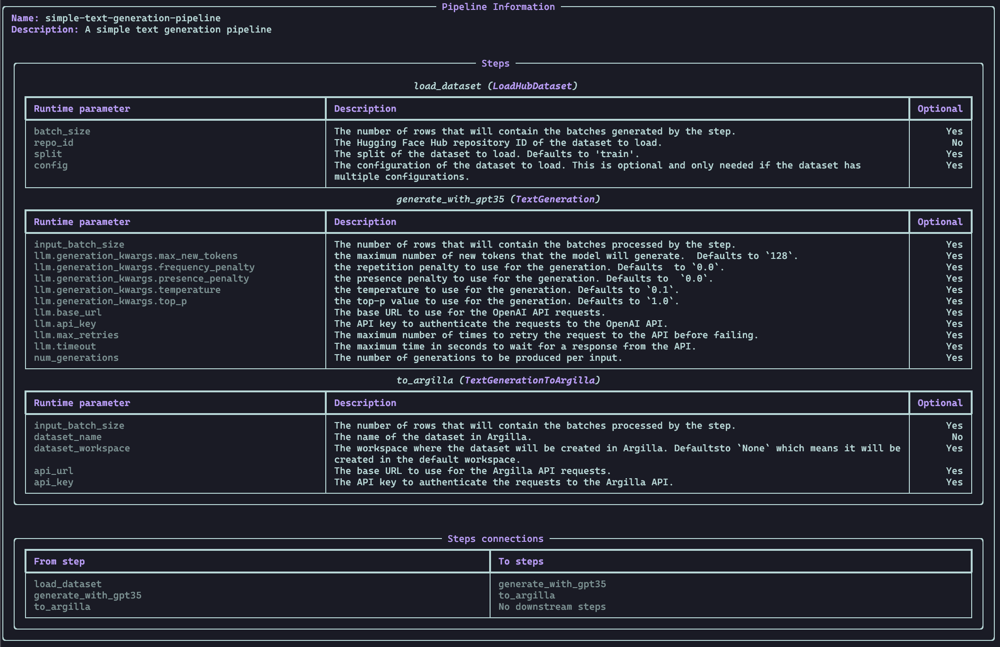

# Command Line Interface (CLI)

`Distilabel` offers a [`CLI`][distilabel.cli.pipeline.utils] to _explore_ and _re-run_ existing [`Pipeline`][distilabel.pipeline.Pipeline] dumps, meaning that an existing dump can be explored to see the steps, how those are connected, the runtime parameters used, and also re-run it with the same or different runtime parameters, respectively.

## Available commands

The only available command as of the current version of `distilabel` is `distilabel pipeline`.

```bash
$ distilabel pipeline --help

 Usage: distilabel pipeline [OPTIONS] COMMAND [ARGS]...

 Commands to run and inspect Distilabel pipelines.

╭─ Options ───────────────────────────────────────────────────────────────────────────────╮
│ --help          Show this message and exit.                                             │
╰─────────────────────────────────────────────────────────────────────────────────────────╯
╭─ Commands ──────────────────────────────────────────────────────────────────────────────╮
│ info      Get information about a Distilabel pipeline.                                  │
│ run       Run a Distilabel pipeline.                                                    │
╰─────────────────────────────────────────────────────────────────────────────────────────╯
```

So on, `distilabel pipeline` has two subcommands: `info` and `run`, as described below. Note that for testing purposes we will be using the following [dataset](https://huggingface.co/datasets/distilabel-internal-testing/ultrafeedback-mini).

### `distilabel pipeline info`

```bash
$ distilabel pipeline info --help

 Usage: distilabel pipeline info [OPTIONS]

 Get information about a Distilabel pipeline.

╭─ Options ───────────────────────────────────────────────────────────────────────────╮
│ *  --config        TEXT  Path or URL to the Distilabel pipeline configuration file. │
│                          [default: None]                                            │
│                          [required]                                                 │
│    --help                Show this message and exit.                                │
╰─────────────────────────────────────────────────────────────────────────────────────╯
```

As we can see from the help message, we need to pass either a `Path` or a `URL`. This second option comes handy for datasets stored in Hugging Face Hub, for example:

```bash
distilabel pipeline info --config "https://huggingface.co/datasets/distilabel-internal-testing/instruction-dataset-mini-with-generations/raw/main/pipeline.yaml"
```

If we take a look:



The pipeline information includes the steps used in the `Pipeline` along with the `Runtime Parameter` that was used, as well as a description of each of them, and also the connections between these steps. These can be helpful to explore the Pipeline locally.

### `distilabel pipeline run`

We can also run a `Pipeline` from the CLI just pointing to the same `pipeline.yaml` file or an URL pointing to it and calling `distilabel pipeline run`. Alternatively, an URL pointing to a Python script containing a distilabel pipeline can be used:

```bash
$ distilabel pipeline run --help

 Usage: distilabel pipeline run [OPTIONS]

 Run a Distilabel pipeline.

╭─ Options ──────────────────────────────────────────────────────────────────────────────────────────────────────────────────────────╮
│ --param                                          PARSE_RUNTIME_PARAM  [default: (dynamic)]                                         │
│ --config                                         TEXT                 Path or URL to the Distilabel pipeline configuration file.   │
│                                                                       [default: None]                                              │
│ --script                                         TEXT                 URL pointing to a python script containing a distilabel      │
│                                                                       pipeline.                                                    │
│                                                                       [default: None]                                              │
│ --pipeline-variable-name                         TEXT                 Name of the pipeline in a script. I.e. the 'pipeline'        │
│                                                                       variable in `with Pipeline(...) as pipeline:...`.            │
│                                                                       [default: pipeline]                                          │
│ --ignore-cache              --no-ignore-cache                         Whether to ignore the cache and re-run the pipeline from     │
│                                                                       scratch.                                                     │
│                                                                       [default: no-ignore-cache]                                   │
│ --repo-id                                        TEXT                 The Hugging Face Hub repository ID to push the resulting     │
│                                                                       dataset to.                                                  │
│                                                                       [default: None]                                              │
│ --commit-message                                 TEXT                 The commit message to use when pushing the dataset.          │
│                                                                       [default: None]                                              │
│ --private                   --no-private                              Whether to make the resulting dataset private on the Hub.    │
│                                                                       [default: no-private]                                        │
│ --token                                          TEXT                 The Hugging Face Hub API token to use when pushing the       │
│                                                                       dataset.                                                     │
│                                                                       [default: None]                                              │
│ --help                                                                Show this message and exit.                                  │
╰────────────────────────────────────────────────────────────────────────────────────────────────────────────────────────────────────╯
```

Using `--config` option, we must pass a path with a `pipeline.yaml` file.
To specify the runtime parameters of the steps we will need to use the `--param` option and the value of the parameter in the following format:

```bash
distilabel pipeline run --config "https://huggingface.co/datasets/distilabel-internal-testing/instruction-dataset-mini-with-generations/raw/main/pipeline.yaml" \
	--param load_dataset.repo_id=distilabel-internal-testing/instruction-dataset-mini \
	--param load_dataset.split=test \
	--param generate_with_gpt35.llm.generation_kwargs.max_new_tokens=512 \
	--param generate_with_gpt35.llm.generation_kwargs.temperature=0.7 \
	--param to_argilla.dataset_name=text_generation_with_gpt35 \
	--param to_argilla.dataset_workspace=admin
```

Or using `--script` we can pass directly a remote python script (keep in mind `--config` and `--script` are exclusive):

```bash
distilabel pipeline run --script "https://huggingface.co/datasets/distilabel-internal-testing/pipe_nothing_test/raw/main/pipe_nothing.py"
```

You can also pass runtime parameters to the python script as we saw with `--config` option.

Again, this helps with the reproducibility of the results, and simplifies sharing not only the final dataset but also the process to generate it.
