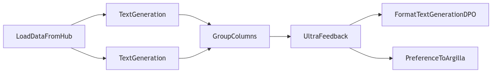

# Concepts

## Pipeline

Distilabel provides all the tools you need to your scalable and reliable pipelines for synthetic data generation and AI-feedback. Pipelines are used to generate data, evaluate models, manipulate data, or any other general task. They are made up of different components: Steps, Tasks and LLMs, which are chained together in a directed acyclic graph (DAG).

- Steps are the building blocks of your pipeline. Normal steps are used for basic executions like loading data, applying some transformations, or any other general task.
- Tasks are steps that rely on LLMs and prompts to perform more specific tasks. For example, they can be used to generate data, evaluate models or manipulate data.
- LLMs are the models that will perform the task. They can be local or remote models, and open-source or commercial models.

Pipelines are designed to be scalable and reliable. They can be executed in a distributed manner, and they can be cached and recovered. This is useful when dealing with large datasets or when you want to ensure that your pipeline is reproducible.

Besides that, pipelines are designed to be modular and flexible. You can easily add new steps, tasks, or LLMs to your pipeline, and you can also easily modify or remove them. An example architecture of a pipeline to generate a dataset of preferences is the following:



### Minimal code example

`distilabel` gives a lot of flexibility to create your pipelines, but to start right away, you can omit a lot of the details and let default values:

```python
from distilabel.llms import InferenceEndpointsLLM
from distilabel.pipeline import Pipeline
from distilabel.steps.tasks import TextGeneration
from distilabel.steps import LoadDataFromDict
from datasets import load_dataset


dataset = load_dataset("distilabel-internal-testing/instruction-dataset-mini", split="test")

with Pipeline() as pipeline:  # (1)
    load_data_from_dict = LoadDataFromDict(
        data={
            "instruction": dataset["instruction"],
            "response": dataset["response"],
        }
    ) # (2)
    text_generation = TextGeneration(
        llm=InferenceEndpointsLLM(
            model_id="meta-llama/Meta-Llama-3.1-8B-Instruct"
        ),
        prompt=PromptTemplate(
            template="Generate a short text: {instruction}"
        ),
    )  # (3)
    load_data_from_dict.connect(text_generation)


if __name__ == "__main__":
    distiset = pipeline.run()
    distiset.push_to_hub(repo_id="distilabel-example")
```

1. The [`Pipeline`][distilabel.pipeline.Pipeline].

2. The [`Step`][distilabel.steps.base.Step] that loads data from a dictionary.

3. The [`Task`][distilabel.steps.tasks.base.Task] that executes a prompt.

## Types of synthetic data generation

There are a lot of different Tasks and Steps available in Distilabel, and you can find more information about them in the [Components](../../components-gallery) section. Here is a summary of the most common categories:

| Name | Emoticon | Description |
|------|----------|-------------|
| Text Generation | :material-text-box-edit: | Text generation steps are used to generate text based on a given prompt. |
| Evol | :material-dna: | Evol steps are used to rewrite input text and evolve it to a higher quality. |
| Text Manipulation | :material-receipt-text-edit: | Text manipulation steps are used to manipulate or rewrite an input text. |
| Critique | :material-comment-edit: | Critique steps are used to provide feedback on the quality of the data with a written explanation. |
| Scorer | :octicons-number-16: | Scorer steps are used to evaluate and score the data with a numerical value. |
| Preference | :material-poll: | Preference steps are used to collect preferences on the data with numerical values or ranks. |
| Embedding | :material-vector-line: | Embedding steps are used to generate embeddings for the data. |
| Columns | :material-table-column: | Columns steps are used to manipulate columns in the data. |
| Filtering | :material-filter: | Filtering steps are used to filter the data based on some criteria. |
| Format | :material-format-list-bulleted: | Format steps are used to format the data. |
| Load | :material-file-download: | Load steps are used to load the data. |
| Save | :material-content-save: | Save steps are used to save the data. |


