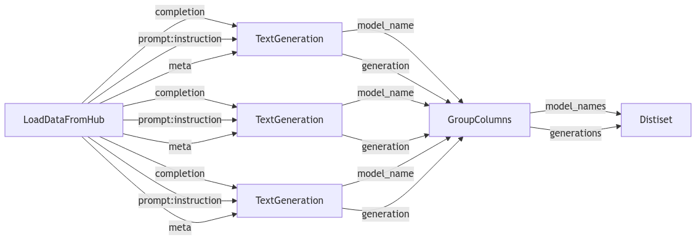

# Execute Steps and Tasks in a Pipeline

## How to create a pipeline

[`Pipeline`][distilabel.pipeline.Pipeline] organise the Steps and Tasks in a sequence, where the output of one step is the input of the next one.
A [`Pipeline`][distilabel.pipeline.Pipeline] should be created by making use of the context manager along with passing a **name**, and optionally a **description**.

```python
from distilabel.pipeline import Pipeline

with Pipeline("pipe-name", description="My first pipe") as pipeline:
    ...
```

### Connecting steps with the `Step.connect` method

Now, we can define the steps of our [`Pipeline`][distilabel.pipeline.Pipeline].

!!! NOTE
    Steps without predecessors (i.e. root steps), need to be [`GeneratorStep`][distilabel.steps.GeneratorStep]s such as [`LoadDataFromDicts`][distilabel.steps.LoadDataFromDicts] or [`LoadDataFromHub`][distilabel.steps.LoadDataFromHub]. After this, other steps can be defined.


```python
from distilabel.pipeline import Pipeline
from distilabel.steps import LoadDataFromHub

with Pipeline("pipe-name", description="My first pipe") as pipeline:
    load_dataset = LoadDataFromHub(name="load_dataset")
    ...
```

!!! Tip "Easily load your datasets"

    If you are already used to work with Hugging Face's `Dataset` via `load_dataset` or `pd.DataFrame`, you can create the `GeneratorStep` directly from the dataset (or dataframe), and create the step with the help of [`make_generator_step`][distilabel.steps.generators.utils.make_generator_step]:

    === "From a list of dicts"

        ```python
        from distilabel.pipeline import Pipeline
        from distilabel.steps import make_generator_step

        dataset = [{"instruction": "Tell me a joke."}]

        with Pipeline("pipe-name", description="My first pipe") as pipeline:
            loader = make_generator_step(dataset, output_mappings={"prompt": "instruction"})
            ...
        ```

    === "From `datasets.Dataset`"

        ```python
        from datasets import load_dataset
        from distilabel.pipeline import Pipeline
        from distilabel.steps import make_generator_step

        dataset = load_dataset(
            "DIBT/10k_prompts_ranked",
            split="train"
        ).filter(
            lambda r: r["avg_rating"]>=4 and r["num_responses"]>=2
        ).select(range(500))

        with Pipeline("pipe-name", description="My first pipe") as pipeline:
            loader = make_generator_step(dataset, output_mappings={"prompt": "instruction"})
            ...
        ```

    === "From `pd.DataFrame`"

        ```python
        import pandas as pd
        from distilabel.pipeline import Pipeline
        from distilabel.steps import make_generator_step

        dataset = pd.read_csv("path/to/dataset.csv")

        with Pipeline("pipe-name", description="My first pipe") as pipeline:
            loader = make_generator_step(dataset, output_mappings={"prompt": "instruction"})
            ...
        ```

Next, we will use `prompt` column from the dataset obtained through `LoadDataFromHub` and use several `LLM`s to execute a `TextGeneration` task. We will also use the `Task.connect()` method to connect the steps, so the output of one step is the input of the next one.

!!! NOTE
    The order of the execution of the steps will be determined by the connections of the steps. In this case, the `TextGeneration` tasks will be executed after the `LoadDataFromHub` step.

```python
from distilabel.models import MistralLLM, OpenAILLM, VertexAILLM
from distilabel.pipeline import Pipeline
from distilabel.steps import LoadDataFromHub
from distilabel.steps.tasks import TextGeneration

with Pipeline("pipe-name", description="My first pipe") as pipeline:
    load_dataset = LoadDataFromHub(name="load_dataset")

    for llm in (
        OpenAILLM(model="gpt-4-0125-preview"),
        MistralLLM(model="mistral-large-2402"),
        VertexAILLM(model="gemini-1.5-pro"),
    ):
        task = TextGeneration(name=f"text_generation_with_{llm.model_name}", llm=llm)
        task.connect(load_dataset)

    ...
```

For each row of the dataset, the `TextGeneration` task will generate a text based on the `instruction` column and the `LLM` model, and store the result (a single string) in a new column called `generation`. Because we need to have the `response`s in the same column, we will add `GroupColumns` to combine them all in the same column as a list of strings.

!!! NOTE
    In this case, the `GroupColumns` tasks will be executed after all `TextGeneration` steps.

```python
from distilabel.models import MistralLLM, OpenAILLM, VertexAILLM
from distilabel.pipeline import Pipeline
from distilabel.steps import GroupColumns, LoadDataFromHub
from distilabel.steps.tasks import TextGeneration

with Pipeline("pipe-name", description="My first pipe") as pipeline:
    load_dataset = LoadDataFromHub(name="load_dataset")

    combine_generations = GroupColumns(
        name="combine_generations",
        columns=["generation", "model_name"],
        output_columns=["generations", "model_names"],
    )

    for llm in (
        OpenAILLM(model="gpt-4-0125-preview"),
        MistralLLM(model="mistral-large-2402"),
        VertexAILLM(model="gemini-1.5-pro"),
    ):
        task = TextGeneration(name=f"text_generation_with_{llm.model_name}", llm=llm)
        load_dataset.connect(task)
        task.connect(combine_generations)
```

### Connecting steps with the `>>` operator

Besides the `Step.connect` method: `step1.connect(step2)`, there's an alternative way by making use of the `>>` operator. We can connect steps in a more readable way, and it's also possible to connect multiple steps at once.

=== "Step per step"

    Each call to `step1.connect(step2)` has been exchanged by `step1 >> step2` within the loop.

    ```python
    from distilabel.models import MistralLLM, OpenAILLM, VertexAILLM
    from distilabel.pipeline import Pipeline
    from distilabel.steps import GroupColumns, LoadDataFromHub
    from distilabel.steps.tasks import TextGeneration

    with Pipeline("pipe-name", description="My first pipe") as pipeline:
        load_dataset = LoadDataFromHub(name="load_dataset")

        combine_generations = GroupColumns(
            name="combine_generations",
            columns=["generation", "model_name"],
            output_columns=["generations", "model_names"],
        )

        for llm in (
            OpenAILLM(model="gpt-4-0125-preview"),
            MistralLLM(model="mistral-large-2402"),
            VertexAILLM(model="gemini-1.5-pro"),
        ):
            task = TextGeneration(name=f"text_generation_with_{llm.model_name}", llm=llm)
            load_dataset >> task >> combine_generations
    ```

=== "Multiple steps at once"

    Each task is first appended to a list, and then all the calls to connections are done in a single call.

    ```python
    from distilabel.models import MistralLLM, OpenAILLM, VertexAILLM
    from distilabel.pipeline import Pipeline
    from distilabel.steps import GroupColumns, LoadDataFromHub
    from distilabel.steps.tasks import TextGeneration

    with Pipeline("pipe-name", description="My first pipe") as pipeline:
        load_dataset = LoadDataFromHub(name="load_dataset")

        combine_generations = GroupColumns(
            name="combine_generations",
            columns=["generation", "model_name"],
            output_columns=["generations", "model_names"],
        )

        tasks = []
        for llm in (
            OpenAILLM(model="gpt-4-0125-preview"),
            MistralLLM(model="mistral-large-2402"),
            VertexAILLM(model="gemini-1.5-pro"),
        ):
            tasks.append(
                TextGeneration(name=f"text_generation_with_{llm.model_name}", llm=llm)
            )

        load_dataset >> tasks >> combine_generations
    ```

### Routing batches to specific downstream steps

In some pipelines, you may want to send batches from a single upstream step to specific downstream steps based on certain conditions. To achieve this, you can use a `routing_batch_function`. This function takes a list of downstream steps and returns a list of step names to which each batch should be routed.

Let's update the example above to route the batches loaded by the `LoadDataFromHub` step to just 2 of the `TextGeneration` tasks. First, we will create our custom [`routing_batch_function`][distilabel.pipeline.routing_batch_function.routing_batch_function], and then we will update the pipeline to use it:

```python
import random
from distilabel.models import MistralLLM, OpenAILLM, VertexAILLM
from distilabel.pipeline import Pipeline, routing_batch_function
from distilabel.steps import GroupColumns, LoadDataFromHub
from distilabel.steps.tasks import TextGeneration

@routing_batch_function
def sample_two_steps(steps: list[str]) -> list[str]:
    return random.sample(steps, 2)

with Pipeline("pipe-name", description="My first pipe") as pipeline:
    load_dataset = LoadDataFromHub(
        name="load_dataset",
        output_mappings={"prompt": "instruction"},
    )

    tasks = []
    for llm in (
        OpenAILLM(model="gpt-4-0125-preview"),
        MistralLLM(model="mistral-large-2402"),
        VertexAILLM(model="gemini-1.0-pro"),
    ):
        tasks.append(
            TextGeneration(name=f"text_generation_with_{llm.model_name}", llm=llm)
        )

    combine_generations = GroupColumns(
        name="combine_generations",
        columns=["generation", "model_name"],
        output_columns=["generations", "model_names"],
    )

    load_dataset >> sample_two_steps >> tasks >> combine_generations
```

 The `routing_batch_function` that we just built is a common one, so `distilabel` comes with a builtin function that can be used to achieve the same behavior:

```python
from distilable.pipeline import sample_n_steps

sample_two_steps = sample_n_steps(2)
```

## Running the pipeline

### Pipeline.dry_run

Before running the `Pipeline` we can check if the pipeline is valid using the `Pipeline.dry_run()` method. It takes the same parameters as the `run` method which we will discuss in the following section, plus the `batch_size` we want the dry run to use (by default set to 1).

```python
with Pipeline("pipe-name", description="My first pipe") as pipeline:
    ...

if __name__ == "__main__":
    distiset = pipeline.dry_run(parameters=..., batch_size=1)
```

### Pipeline.run

After testing, we can now execute the full `Pipeline` using the `Pipeline.run()` method.

```python
with Pipeline("pipe-name", description="My first pipe") as pipeline:
    ...

if __name__ == "__main__":
    distiset = pipeline.run(
        parameters={
            "load_dataset": {
                "repo_id": "distilabel-internal-testing/instruction-dataset-mini",
                "split": "test",
            },
            "text_generation_with_gpt-4-0125-preview": {
                "llm": {
                    "generation_kwargs": {
                        "temperature": 0.7,
                        "max_new_tokens": 512,
                    }
                }
            },
            "text_generation_with_mistral-large-2402": {
                "llm": {
                    "generation_kwargs": {
                        "temperature": 0.7,
                        "max_new_tokens": 512,
                    }
                }
            },
            "text_generation_with_gemini-1.0-pro": {
                "llm": {
                    "generation_kwargs": {
                        "temperature": 0.7,
                        "max_new_tokens": 512,
                    }
                }
            },
        },
    )
```

But if we run the pipeline above, we will see that the `run` method will fail:

```
ValueError: Step 'text_generation_with_gpt-4-0125-preview' requires inputs ['instruction'], but only the inputs=['prompt', 'completion', 'meta'] are available, which means that the inputs=['instruction'] are missing or not available
when the step gets to be executed in the pipeline. Please make sure previous steps to 'text_generation_with_gpt-4-0125-preview' are generating the required inputs.
```

This is because, before actually running the pipeline, we must ensure each step has the necessary input columns to be executed. In this case, the `TextGeneration` task requires the `instruction` column, but the `LoadDataFromHub` step generates the `prompt` column. To solve this, we can use the `output_mappings` or `input_mapping` arguments of individual `Step`s, to map columns from one step to another.

```python
with Pipeline("pipe-name", description="My first pipe") as pipeline:
    load_dataset = LoadDataFromHub(
        name="load_dataset",
        output_mappings={"prompt": "instruction"}
    )

    ...
```

If we execute the pipeline again, it will run successfully and we will have a `Distiset` with the outputs of all the leaf steps of the pipeline which we can push to the Hugging Face Hub.

```python
if __name__ == "__main__":
    distiset = pipeline.run(...)
    distiset.push_to_hub("distilabel-internal-testing/instruction-dataset-mini-with-generations")
```

#### Pipeline.run with a dataset

Note that in most cases if you don't need the extra flexibility the [`GeneratorSteps`][distilabel.steps.base.GeneratorStep] bring you, you can create a dataset as you would normally do and pass it to the [Pipeline.run][distilabel.pipeline.base.BasePipeline.run] method directly. Look at the highlighted lines to see the updated lines:

```python hl_lines="11-14 33 38"
import random
from distilabel.models import MistralLLM, OpenAILLM, VertexAILLM
from distilabel.pipeline import Pipeline, routing_batch_function
from distilabel.steps import GroupColumns
from distilabel.steps.tasks import TextGeneration

@routing_batch_function
def sample_two_steps(steps: list[str]) -> list[str]:
    return random.sample(steps, 2)

dataset = load_dataset(
    "distilabel-internal-testing/instruction-dataset-mini",
    split="test"
)

with Pipeline("pipe-name", description="My first pipe") as pipeline:
    tasks = []
    for llm in (
        OpenAILLM(model="gpt-4-0125-preview"),
        MistralLLM(model="mistral-large-2402"),
        VertexAILLM(model="gemini-1.0-pro"),
    ):
        tasks.append(
            TextGeneration(name=f"text_generation_with_{llm.model_name}", llm=llm)
        )

    combine_generations = GroupColumns(
        name="combine_generations",
        columns=["generation", "model_name"],
        output_columns=["generations", "model_names"],
    )

    sample_two_steps >> tasks >> combine_generations


if __name__ == "__main__":
    distiset = pipeline.run(
        dataset=dataset,
        parameters=...
    )
```


### Stopping the pipeline

In case you want to stop the pipeline while it's running, you can press ++ctrl+c++ or ++cmd+c++ depending on your OS (or send a `SIGINT` to the main process), and the outputs will be stored in the cache. Pressing an additional time will force the pipeline to stop its execution, but this can lead to losing the generated outputs for certain batches.

## Cache

If for some reason, the pipeline execution stops (for example by pressing `Ctrl+C`), the state of the pipeline and the outputs will be stored in the cache, so we can resume the pipeline execution from the point where it was stopped.

If we want to force the pipeline to run again without can, then we can use the `use_cache` argument of the `Pipeline.run()` method:

```python
if __name__ == "__main__":
    distiset = pipeline.run(parameters={...}, use_cache=False)
```

!!! NOTE
    For more information on caching, we refer the reader to the [caching](../../advanced/caching.md) section.

## Adjusting the batch size for each step

Memory issues can arise when processing large datasets or when using large models. To avoid this, we can use the `input_batch_size` argument of individual tasks. `TextGeneration` task will receive 5 dictionaries, while the `LoadDataFromHub` step will send 10 dictionaries per batch:

```python
from distilabel.models import MistralLLM, OpenAILLM, VertexAILLM
from distilabel.pipeline import Pipeline
from distilabel.steps import GroupColumns, LoadDataFromHub
from distilabel.steps.tasks import TextGeneration

with Pipeline("pipe-name", description="My first pipe") as pipeline:
    load_dataset = LoadDataFromHub(
        name="load_dataset",
        output_mappings={"prompt": "instruction"},
        batch_size=10
    )

    for llm in (
        OpenAILLM(model="gpt-4-0125-preview"),
        MistralLLM(model="mistral-large-2402"),
        VertexAILLM(model="gemini-1.5-pro"),
    ):
        task = TextGeneration(
            name=f"text_generation_with_{llm.model_name.replace('.', '-')}",
            llm=llm,
            input_batch_size=5,
        )

    ...
```

## Serializing the pipeline

Sharing a pipeline with others is very easy, as we can serialize the pipeline object using the `save` method. We can save the pipeline in different formats, such as `yaml` or `json`:

=== "yaml"
    ```python
    if __name__ == "__main__":
        pipeline.save("pipeline.yaml", format="yaml")
    ```

=== "json"
    ```python
    if __name__ == "__main__":
        pipeline.save("pipeline.json", format="json")
    ```

To load the pipeline, we can use the `from_yaml` or `from_json` methods:

=== "yaml"
    ```python
    pipeline = Pipeline.from_yaml("pipeline.yaml")
    ```

=== "json"
    ```python
    pipeline = Pipeline.from_json("pipeline.json")
    ```

Serializing the pipeline is very useful when we want to share the pipeline with others, or when we want to store the pipeline for future use. It can even be hosted online, so the pipeline can be executed directly using the [CLI](../../advanced/cli/index.md).

## Visualizing the pipeline

We can visualize the pipeline using the `Pipeline.draw()` method. This will create a `mermaid` graph, and return the path to the image.

```python
path_to_image = pipeline.draw(
    top_to_bottom=True,
    show_edge_labels=True,
)
```

Within notebooks, we can simply call `pipeline` and the graph will be displayed. Alternatively, we can use the `Pipeline.draw()` method to have more control over the graph visualization and use `IPython` to display it.

```python
from IPython.display import Image, display

display(Image(path_to_image))
```

Let's now see how the pipeline of the [fully working example](#fully-working-example) looks like.




## Fully working example

To sum up, here is the full code of the pipeline we have created in this section. Note that you will need to change the name of the Hugging Face repository where the resulting will be pushed, set `OPENAI_API_KEY` environment variable, set `MISTRAL_API_KEY` and have `gcloud` installed and configured:

??? Code
    ```python
    from distilabel.models import MistralLLM, OpenAILLM, VertexAILLM
    from distilabel.pipeline import Pipeline
    from distilabel.steps import GroupColumns, LoadDataFromHub
    from distilabel.steps.tasks import TextGeneration

    with Pipeline("pipe-name", description="My first pipe") as pipeline:
        load_dataset = LoadDataFromHub(
            name="load_dataset",
            output_mappings={"prompt": "instruction"},
        )

        combine_generations = GroupColumns(
            name="combine_generations",
            columns=["generation", "model_name"],
            output_columns=["generations", "model_names"],
        )

        for llm in (
            OpenAILLM(model="gpt-4-0125-preview"),
            MistralLLM(model="mistral-large-2402"),
            VertexAILLM(model="gemini-1.0-pro"),
        ):
            task = TextGeneration(
                name=f"text_generation_with_{llm.model_name.replace('.', '-')}", llm=llm
            )
            load_dataset.connect(task)
            task.connect(combine_generations)

    if __name__ == "__main__":
        distiset = pipeline.run(
            parameters={
                "load_dataset": {
                    "repo_id": "distilabel-internal-testing/instruction-dataset-mini",
                    "split": "test",
                },
                "text_generation_with_gpt-4-0125-preview": {
                    "llm": {
                        "generation_kwargs": {
                            "temperature": 0.7,
                            "max_new_tokens": 512,
                        }
                    }
                },
                "text_generation_with_mistral-large-2402": {
                    "llm": {
                        "generation_kwargs": {
                            "temperature": 0.7,
                            "max_new_tokens": 512,
                        }
                    }
                },
                "text_generation_with_gemini-1.0-pro": {
                    "llm": {
                        "generation_kwargs": {
                            "temperature": 0.7,
                            "max_new_tokens": 512,
                        }
                    }
                },
            },
        )
        distiset.push_to_hub(
            "distilabel-internal-testing/instruction-dataset-mini-with-generations"
        )
    ```

