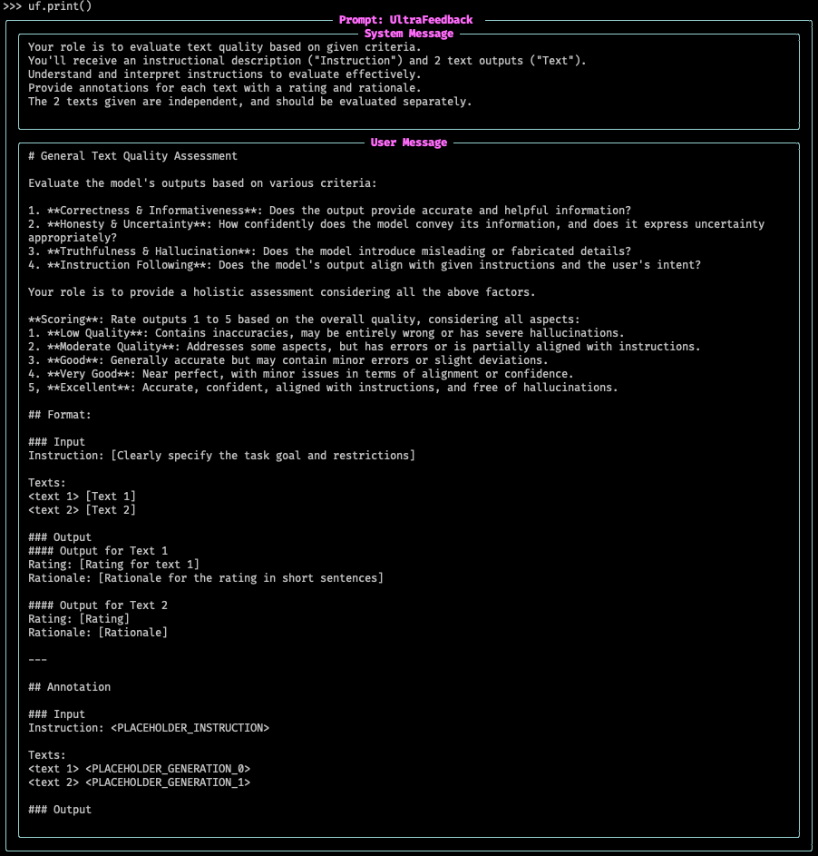

# Tasks for generating and judging with LLMs

## Working with Tasks

The [`Task`][distilabel.steps.tasks.Task] is a special kind of [`Step`][distilabel.steps.Step] that includes the [`LLM`][distilabel.models.llms.LLM] as a mandatory argument. As with a [`Step`][distilabel.steps.Step], it is normally used within a [`Pipeline`][distilabel.pipeline.Pipeline] but can also be used standalone.

For example, the most basic task is the [`TextGeneration`][distilabel.steps.tasks.TextGeneration] task, which generates text based on a given instruction.

```python
from distilabel.models import InferenceEndpointsLLM
from distilabel.steps.tasks import TextGeneration

task = TextGeneration(
    name="text-generation",
    llm=InferenceEndpointsLLM(
        model_id="meta-llama/Meta-Llama-3-70B-Instruct",
        tokenizer_id="meta-llama/Meta-Llama-3-70B-Instruct",
    ),
)
task.load()

next(task.process([{"instruction": "What's the capital of Spain?"}]))
# [
#     {
#         'instruction': "What's the capital of Spain?",
#         'generation': 'The capital of Spain is Madrid.',
#         'distilabel_metadata': {
#               'raw_output_text-generation': 'The capital of Spain is Madrid.',
#               'raw_input_text-generation': [
#                   {'role': 'user', 'content': "What's the capital of Spain?"}
#               ]
#         },
#         'model_name': 'meta-llama/Meta-Llama-3-70B-Instruct'
#     }
# ]
```

!!! NOTE
    The `Step.load()` always needs to be executed when being used as a standalone. Within a pipeline, this will be done automatically during pipeline execution.

As shown above, the [`TextGeneration`][distilabel.steps.tasks.TextGeneration] task adds a `generation` based on the `instruction`.

!!! Tip
    Since version `1.2.0`, we provide some metadata about the LLM call through `distilabel_metadata`. This can be disabled by setting the `add_raw_output` attribute to `False` when creating the task.

    Additionally, since version `1.4.0`, the formatted input can also be included, which can be helpful when testing
    custom templates (testing the pipeline using the [`dry_run`][distilabel.pipeline.local.Pipeline.dry_run] method).

    ```python title="disable raw input and output"
    task = TextGeneration(
        llm=InferenceEndpointsLLM(
            model_id="meta-llama/Meta-Llama-3.1-70B-Instruct",
            tokenizer_id="meta-llama/Meta-Llama-3.1-70B-Instruct",
        ),
        add_raw_output=False,
        add_raw_input=False
    )
    ```

### Task.print

!!! Info
    New since version `1.4.0`, [`Task.print`][distilabel.steps.tasks.base._Task.print] `Task.print` method.

The `Tasks` include a handy method to show what the prompt formatted for an `LLM` would look like, let's see an example with [`UltraFeedback`][distilabel.steps.tasks.ultrafeedback.UltraFeedback], but it applies to any other `Task`.

```python
from distilabel.steps.tasks import UltraFeedback
from distilabel.models import InferenceEndpointsLLM

uf = UltraFeedback(
    llm=InferenceEndpointsLLM(
        model_id="meta-llama/Meta-Llama-3.1-70B-Instruct",
    ),
)
uf.load()
uf.print()
```

The result will be a rendered prompt, with the System prompt (if contained for the task) and the User prompt, rendered with rich (it will show exactly the same in a jupyter notebook).



In case you want to test with a custom input, you can pass an example to the tasks` `format_input` method (or generate it on your own depending on the task), and pass it to the print method so that it shows your example:


```python
uf.print(
    uf.format_input({"instruction": "test", "generations": ["1", "2"]})
)
```

??? "Using a DummyLLM to avoid loading one"

    In case you don't want to load an LLM to render the template, you can create a dummy one like the ones we could use for testing.

    ```python
    from distilabel.models import LLM
    from distilabel.models.mixins import MagpieChatTemplateMixin

    class DummyLLM(AsyncLLM, MagpieChatTemplateMixin):
        structured_output: Any = None
        magpie_pre_query_template: str = "llama3"

        def load(self) -> None:
            pass

        @property
        def model_name(self) -> str:
            return "test"

        def generate(
            self, input: "FormattedInput", num_generations: int = 1
        ) -> "GenerateOutput":
            return ["output" for _ in range(num_generations)]
    ```

    You can use this `LLM` just as any of the other ones to `load` your task and call `print`:

    ```python
    uf = UltraFeedback(llm=DummyLLM())
    uf.load()
    uf.print()
    ```

!!! Note
    When creating a custom task, the `print` method will be available by default, but it is limited to the most common scenarios for the inputs. If you test your new task and find it's not working as expected (for example, if your task contains one input consisting of a list of texts instead of a single one), you should override the `_sample_input` method. You can inspect the [`UltraFeedback`][distilabel.steps.tasks.ultrafeedback.UltraFeedback] source code for this.

## Specifying the number of generations and grouping generations

All the `Task`s have a `num_generations` attribute that allows defining the number of generations that we want to have per input. We can update the example above to generate 3 completions per input:

```python
from distilabel.models import InferenceEndpointsLLM
from distilabel.steps.tasks import TextGeneration

task = TextGeneration(
    name="text-generation",
    llm=InferenceEndpointsLLM(
        model_id="meta-llama/Meta-Llama-3-70B-Instruct",
        tokenizer_id="meta-llama/Meta-Llama-3-70B-Instruct",
    ),
    num_generations=3,
)
task.load()

next(task.process([{"instruction": "What's the capital of Spain?"}]))
# [
#     {
#         'instruction': "What's the capital of Spain?",
#         'generation': 'The capital of Spain is Madrid.',
#         'distilabel_metadata': {'raw_output_text-generation': 'The capital of Spain is Madrid.'},
#         'model_name': 'meta-llama/Meta-Llama-3-70B-Instruct'
#     },
#     {
#         'instruction': "What's the capital of Spain?",
#         'generation': 'The capital of Spain is Madrid.',
#         'distilabel_metadata': {'raw_output_text-generation': 'The capital of Spain is Madrid.'},
#         'model_name': 'meta-llama/Meta-Llama-3-70B-Instruct'
#     },
#     {
#         'instruction': "What's the capital of Spain?",
#         'generation': 'The capital of Spain is Madrid.',
#         'distilabel_metadata': {'raw_output_text-generation': 'The capital of Spain is Madrid.'},
#         'model_name': 'meta-llama/Meta-Llama-3-70B-Instruct'
#     }
# ]
```

In addition, we might want to group the generations in a single output row as maybe one downstream step expects a single row with multiple generations. We can achieve this by setting the `group_generations` attribute to `True`:

```python
from distilabel.models import InferenceEndpointsLLM
from distilabel.steps.tasks import TextGeneration

task = TextGeneration(
    name="text-generation",
    llm=InferenceEndpointsLLM(
        model_id="meta-llama/Meta-Llama-3-70B-Instruct",
        tokenizer_id="meta-llama/Meta-Llama-3-70B-Instruct",
    ),
    num_generations=3,
    group_generations=True
)
task.load()

next(task.process([{"instruction": "What's the capital of Spain?"}]))
# [
#     {
#         'instruction': "What's the capital of Spain?",
#         'generation': ['The capital of Spain is Madrid.', 'The capital of Spain is Madrid.', 'The capital of Spain is Madrid.'],
#         'distilabel_metadata': [
#             {'raw_output_text-generation': 'The capital of Spain is Madrid.'},
#             {'raw_output_text-generation': 'The capital of Spain is Madrid.'},
#             {'raw_output_text-generation': 'The capital of Spain is Madrid.'}
#         ],
#         'model_name': 'meta-llama/Meta-Llama-3-70B-Instruct'
#     }
# ]
```

## Defining custom Tasks

We can define a custom step by creating a new subclass of the [`Task`][distilabel.steps.tasks.Task] and defining the following:

- `inputs`: is a property that returns a list of strings with the names of the required input fields or a dictionary in which the keys are the names of the columns and the values are boolean indicating whether the column is required or not.

- `format_input`: is a method that receives a dictionary with the input data and returns a [`ChatType`][distilabel.steps.tasks.ChatType] following [the chat-completion OpenAI message formatting](https://platform.openai.com/docs/guides/text-generation).

- `outputs`: is a property that returns a list of strings with the names of the output fields or a dictionary in which the keys are the names of the columns and the values are boolean indicating whether the column is required or not. This property should always include `model_name` as one of the outputs since that's automatically injected from the LLM.

- `format_output`: is a method that receives the output from the [`LLM`][distilabel.models.llms.LLM] and optionally also the input data (which may be useful to build the output in some scenarios), and returns a dictionary with the output data formatted as needed i.e. with the values for the columns in `outputs`. Note that there's no need to include the `model_name` in the output.

=== "Inherit from `Task`"

    When using the `Task` class inheritance method for creating a custom task, we can also optionally override the `Task.process` method to define a more complex processing logic involving an `LLM`, as the default one just calls the `LLM.generate` method once previously formatting the input and subsequently formatting the output. For example, [EvolInstruct][distilabel.steps.tasks.EvolInstruct] task overrides this method to call the `LLM.generate` multiple times (one for each evolution).

    ```python
    from typing import Any, Dict, List, Union, TYPE_CHECKING

    from distilabel.steps.tasks import Task

    if TYPE_CHECKING:
        from distilabel.steps.typing import StepColumns
        from distilabel.steps.tasks.typing import ChatType


    class MyCustomTask(Task):
        @property
        def inputs(self) -> "StepColumns":
            return ["input_field"]

        def format_input(self, input: Dict[str, Any]) -> "ChatType":
            return [
                {
                    "role": "user",
                    "content": input["input_field"],
                },
            ]

        @property
        def outputs(self) -> "StepColumns":
            return ["output_field", "model_name"]

        def format_output(
            self, output: Union[str, None], input: Dict[str, Any]
        ) -> Dict[str, Any]:
            return {"output_field": output}
    ```

=== "Using the `@task` decorator"

    If your task just needs a system prompt, a user message template and a way to format the output given by the `LLM`, then you can use the `@task` decorator to avoid writing too much boilerplate code.

    ```python
    from typing import Any, Dict, Union
    from distilabel.steps.tasks import task


    @task(inputs=["input_field"], outputs=["output_field"])
    def MyCustomTask(output: Union[str, None], input: Union[Dict[str, Any], None] = None) -> Dict[str, Any]:
        """
        ---
        system_prompt: |
            My custom system prompt

        user_message_template: |
            My custom user message template: {input_field}
        ---
        """
        # Format the `LLM` output here
        return {"output_field": output}
    ```
