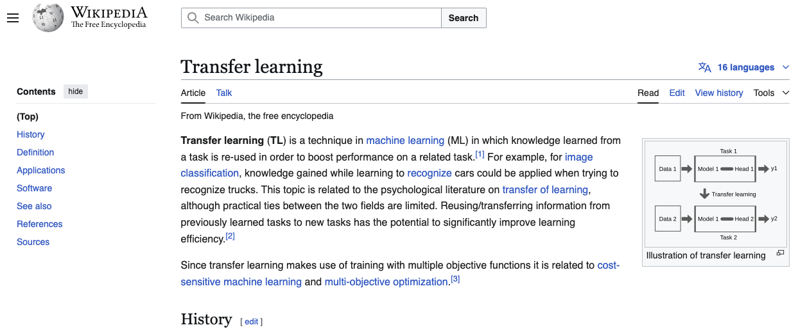

# Create exam questions using structured generation

This example will showcase how to generate exams questions and answers from a text page. In this case, we will use a wikipedia page as an example, and show how to leverage the prompt to help the model generate the data in the appropriate format.

We are going to use a `meta-llama/Meta-Llama-3.1-8B-Instruct` to generate questions and answers for a mock exam from a wikipedia page. In this case, we are going to use the *Transfer Learning* entry for it. With the help of structured generation we will guide the model to create structured data for us that is easy to parse.

??? "Click to see the sample results"

    Example page [Transfer_learning](https://en.wikipedia.org/wiki/Transfer_learning):

    

    QA of the page:

    ```json
    {
        "exam": [
            {
                "answer": "A technique in machine learning where knowledge learned from a task is re-used to boost performance on a related task.",
                "distractors": ["A type of neural network architecture", "A machine learning algorithm for image classification", "A method for data preprocessing"],
                "question": "What is transfer learning?"
            },
            {
                "answer": "1976",
                "distractors": ["1981", "1992", "1998"],
                "question": "In which year did Bozinovski and Fulgosi publish a paper addressing transfer learning in neural network training?"
            },
            {
                "answer": "Discriminability-based transfer (DBT) algorithm",
                "distractors": ["Multi-task learning", "Learning to Learn", "Cost-sensitive machine learning"],
                "question": "What algorithm was formulated by Lorien Pratt in 1992?"
            },
            {
                "answer": "A domain consists of a feature space and a marginal probability distribution.",
                "distractors": ["A domain consists of a label space and an objective predictive function.", "A domain consists of a task and a learning algorithm.", "A domain consists of a dataset and a model."],
                "question": "What is the definition of a domain in the context of transfer learning?"
            },
            {
                "answer": "Transfer learning aims to help improve the learning of the target predictive function in the target domain using the knowledge in the source domain and learning task.",
                "distractors": ["Transfer learning aims to learn a new task from scratch.", "Transfer learning aims to improve the learning of the source predictive function in the source domain.", "Transfer learning aims to improve the learning of the target predictive function in the source domain."],
                "question": "What is the goal of transfer learning?"
            },
            {
                "answer": "Markov logic networks, Bayesian networks, cancer subtype discovery, building utilization, general game playing, text classification, digit recognition, medical imaging, and spam filtering.",
                "distractors": ["Supervised learning, unsupervised learning, reinforcement learning, natural language processing, computer vision, and robotics.", "Image classification, object detection, segmentation, and tracking.", "Speech recognition, sentiment analysis, and topic modeling."],
                "question": "What are some applications of transfer learning?"
            },
            {
                "answer": "ADAPT (Python), TLib (Python), Domain-Adaptation-Toolbox (Matlab)",
                "distractors": ["TensorFlow, PyTorch, Keras", "Scikit-learn, OpenCV, NumPy", "Matlab, R, Julia"],
                "question": "What are some software implementations of transfer learning and domain adaptation algorithms?"
            }
        ]
    }
    ```

## Build the pipeline

Let's see how to build a pipeline to obtain this type of data:

````python
from typing import List
from pathlib import Path

from pydantic import BaseModel, Field

from distilabel.llms import InferenceEndpointsLLM
from distilabel.pipeline import Pipeline
from distilabel.steps import LoadDataFromDicts
from distilabel.steps.tasks import TextGeneration

import wikipedia

page = wikipedia.page(title="Transfer_learning")  # (1)


class ExamQuestion(BaseModel):
    question: str = Field(..., description="The question to be answered")
    answer: str = Field(..., description="The correct answer to the question")
    distractors: List[str] = Field(
        ..., description="A list of incorrect but viable answers to the question"
    )

class ExamQuestions(BaseModel):  # (2)
    exam: List[ExamQuestion]


SYSTEM_PROMPT = """\
You are an exam writer specialized in writing exams for students.
Your goal is to create questions and answers based on the document provided, and a list of distractors, that are incorrect but viable answers to the question.
Your answer must adhere to the following format:
```
[
    {
        "question": "Your question",
        "answer": "The correct answer to the question",
        "distractors": ["wrong answer 1", "wrong answer 2", "wrong answer 3"]
    },
    ... (more questions and answers as required)
]
```
""".strip() # (3)


with Pipeline(name="ExamGenerator") as pipeline:

    load_dataset = LoadDataFromDicts(
        name="load_instructions",
        data=[
            {
                "page": page.content,  # (4)
            }
        ],
    )

    text_generation = TextGeneration(  # (5)
        name="exam_generation",
        system_prompt=SYSTEM_PROMPT,
        template="Generate a list of answers and questions about the document. Document:\n\n{{ page }}",
        llm=InferenceEndpointsLLM(
            model_id="meta-llama/Meta-Llama-3.1-8B-Instruct",
            tokenizer_id="meta-llama/Meta-Llama-3.1-8B-Instruct",
            structured_output={
                "schema": ExamQuestions.model_json_schema(),
                "format": "json"
            },
        ),
        input_batch_size=8,
        output_mappings={"model_name": "generation_model"},
    )

    load_dataset >> text_generation  # (6)
````

1. Download a single page for the demo. We could donwnload first the pages, or apply the same procedure to any type of data we want.

2. Define the structure required for the answer using Pydantic. In this case we want for each page, a list with questions and answers (additionally we've added distractors, but can be ignored for this case). So our output will be a `ExamQuestions` model, which is a list of `ExamQuestion`, where each one consists in the `question` and `answer` fields as string fields.

3. Use the system prompt to guide the model towards the behaviour we want from it. Independently from the structured output we are forcing the model to have, it helps if we pass the format expected in our prompt.

4. Move the page content from wikipedia to a row in the dataset.

5. The [`TextGeneration`](https://distilabel.argilla.io/dev/components-gallery/tasks/textgeneration/) task gets the system prompt, and the user prompt by means of the `template` argument, where we aid the model to generate the questions and answers based on the page content, that will be obtained from the corresponding column of the loaded data.

6. Connect both steps, and we are done.

## Run the example

To run this example you will first need to install the wikipedia dependency to download the sample data, being `pip install wikipedia`. *Change the username first in case you want to push the dataset to the hub using your account*.

??? Run

    ````python
    python examples/exam_questions.py
    ````

    ````python title="exam_questions.py"
    --8<-- "examples/exam_questions.py"
    ````
