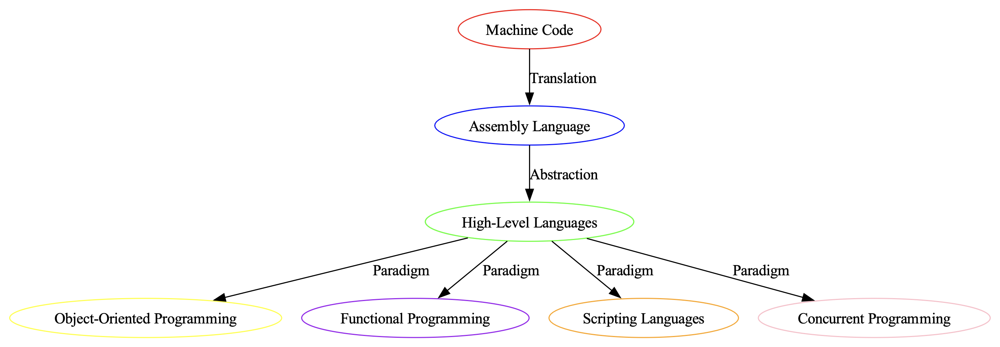

# Examples

This section contains different example pipelines that showcase different tasks, maybe you can take inspiration from them.

### [llama.cpp with `outlines`](#llama-cpp-with-outlines)

Generate RPG characters following a `pydantic.BaseModel` with `outlines` in `distilabel`.

??? Example "See example"

    This script makes use of [`LlamaCppLLM`][distilabel.llms.llamacpp.LlamaCppLLM] and the structured output capabilities thanks to [`outlines`](https://outlines-dev.github.io/outlines/welcome/) to generate RPG characters that adhere to a JSON schema.

    It makes use of a local model which can be downloaded using curl (explained in the script itself), and can be exchanged with other `LLMs` like [`vLLM`][distilabel.llms.vllm.vLLM].

    ??? Run

        ```python
        python examples/structured_generation_with_outlines.py
        ```

    ```python title="structured_generation_with_outlines.py"
    --8<-- "examples/structured_generation_with_outlines.py"
    ```


### [MistralAI with `instructor`](#mistralai-with-instructor)

Answer instructions with knowledge graphs defined as `pydantic.BaseModel` objects using `instructor` in `distilabel`.

??? Example "See example"

    This script makes use of [`MistralLLM`][distilabel.llms.mistral.MistralLLM] and the structured output capabilities thanks to [`instructor`](https://python.useinstructor.com/) to generate knowledge graphs from complex topics.

    This example is translated from this [awesome example](https://python.useinstructor.com/examples/knowledge_graph/) from `instructor` cookbook.

    ??? Run

        ```python
        python examples/structured_generation_with_instructor.py
        ```

    ```python title="structured_generation_with_instructor.py"
    --8<-- "examples/structured_generation_with_instructor.py"
    ```

    ??? "Visualizing the graphs"

        Want to see how to visualize the graphs? You can test it using the following script. Generate some samples on your own and take a look:

        !!! NOTE

            This example uses graphviz to render the graph, you can install with `pip` in the following way:

            ```console
            pip install graphviz
            ```

        ```python
        python examples/draw_kg.py 2  # You can pass 0,1,2 to visualize each of the samples.
        ```

        
