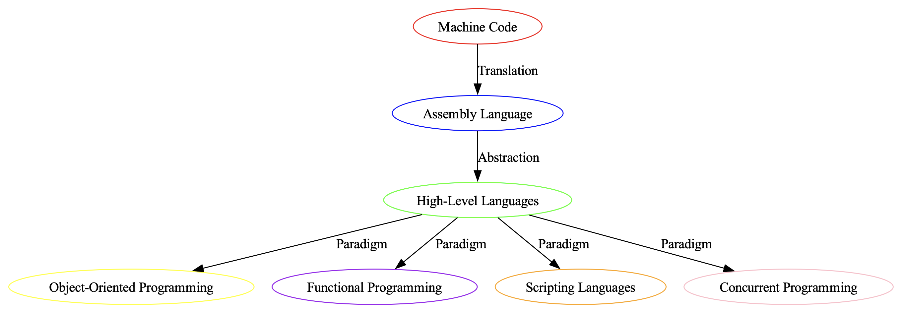

# Structured generation with `instructor`

Answer instructions with knowledge graphs defined as `pydantic.BaseModel` objects using `instructor` in `distilabel`.

This script makes use of [`MistralLLM`][distilabel.models.llms.mistral.MistralLLM] and the structured output capabilities thanks to [`instructor`](https://python.useinstructor.com/) to generate knowledge graphs from complex topics.


This example is translated from this [awesome example](https://python.useinstructor.com/examples/knowledge_graph/) from `instructor` cookbook.

??? Run

    ```python
    python examples/structured_generation_with_instructor.py
    ```

```python title="structured_generation_with_instructor.py"
--8<-- "examples/structured_generation_with_instructor.py"
```

??? "Visualizing the graphs"

    Want to see how to visualize the graphs? You can test it using the following script. Generate some samples on your own and take a look:

    !!! NOTE

        This example uses graphviz to render the graph, you can install with `pip` in the following way:

        ```console
        pip install graphviz
        ```

    ```python
    python examples/draw_kg.py 2  # You can pass 0,1,2 to visualize each of the samples.
    ```

    