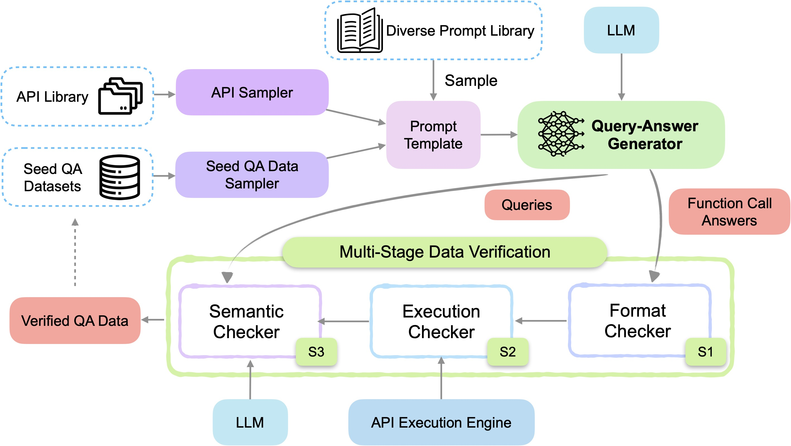

# Create Function-Calling datasets with APIGen

This example will introduce [APIGen: Automated Pipeline for Generating Verifiable and Diverse Function-Calling Datasets](https://arxiv.org/abs/2406.18518), a data generation pipeline designed to synthesize verifiable high-quality datasets for function-calling applications.

## Replication

The following figure showcases the APIGen framework:



Now, let's walk through the key steps illustrated in the figure:

- [`DataSampler`](https://distilabel.argilla.io/dev/components-gallery/step/datasampler/): With the help of this step and the original [Salesforce/xlam-function-calling-60k](https://huggingface.co/datasets/Salesforce/xlam-function-calling-60k) we are getting the Seed QA Data Sampler for the prompt template.

- [`APIGenGenerator`](https://distilabel.argilla.io/dev/components-gallery/task/apigengenerator/): This step does the job of the *Query-Answer Generator*, including the format checker from *Stage 1: Format Checker* thanks to the structured output generation.

- [`APIGenExecutionChecker`](https://distilabel.argilla.io/dev/components-gallery/task/apigenexecutionchecker/): This step is in charge of the *Stage 2: Execution Checker*.

- [`APIGenSemanticChecker`](https://distilabel.argilla.io/dev/components-gallery/task/apigensemanticchecker/): Step in charge of running *Stage 3: Semantic Checker*, can use the same or a different LLM, we are using the same as in [`APIGenGenerator`](https://distilabel.argilla.io/dev/components-gallery/task/apigengenerator/) step.

The current implementation hasn't utilized the *Diverse Prompt Library*. To incorporate it, one could either adjust the prompt template within the [`APIGenGenerator`](https://distilabel.argilla.io/dev/components-gallery/task/apigengenerator/) or develop a new sampler specifically for this purpose. As for the *API Sampler*, while no specific data is shared here, we've created illustrative examples to demonstrate the pipeline's functionality. These examples represent a mix of data that could be used to replicate the sampler's output.

## Data preparation

The original paper tells about the data they used and give some hints, but nothing was shared. In this example, we will write a bunch of examples by hand to showcase how this pipeline can be built.

Assume we have the following function names, and corresponding descriptions of their behaviour:

```python
data = [
    {
        "func_name": "final_velocity",
        "func_desc": "Calculates the final velocity of an object given its initial velocity, acceleration, and time.",
    },
    {
        "func_name": "permutation_count",
        "func_desc": "Calculates the number of permutations of k elements from a set of n elements.",
    },
    {
        "func_name": "getdivision",
        "func_desc": "Divides two numbers by making an API call to a division service.",
    },
    {
        "func_name": "binary_addition",
        "func_desc": "Adds two binary numbers and returns the result as a binary string.",
    },
    {
        "func_name": "swapi_planet_resource",
        "func_desc": "get a specific planets resource",
    },
    {
        "func_name": "disney_character",
        "func_desc": "Find a specific character using this endpoint",
    }
]
```

The original paper refers to both python functions and APIs, but we will make use of python functions exclusively for simplicity. In order to execute and check this functions/APIs, we need access to the code, which we have moved to a python file: [lib_apigen.py](../../../../examples/lib_apigen.py). All this functions are executable, but we also need access to their *tool* representation. For this, we will make use of transformers' *get_json_schema* function[^1].

[^1]: Read this nice blog post for more information on tools and the reasoning behind `get_json_schema`: [Tool Use, Unified](https://huggingface.co/blog/unified-tool-use).

We have all the machinery prepared in our libpath, except from the *tool* definition. With the help of our helper function `load_module_from_path` we will load this python module, collect all the tools, and add them to each row in our `data` variable.

```python
from distilabel.steps.tasks.apigen.utils import load_module_from_path

libpath_module = load_module_from_path(libpath)
tools = getattr(libpath_module, "get_tools")()  # call get_tools()

for row in data:
    # The tools should have a mix where both the correct and irrelevant tools are present.
    row.update({"tools": [tools[row["func_name"]]]})
```

Now we have all the necessary data for our prompt. Additionally, we will make use of the original dataset as few-shot examples to enhance the model:

```python
ds_og = (
    load_dataset("Salesforce/xlam-function-calling-60k", split="train")
    .shuffle(seed=42)
    .select(range(500))
    .to_list()
)
```

We have just loaded a subset and transformed it to a list of dictionaries, as we will use it in the [`DataSampler`](https://distilabel.argilla.io/dev/components-gallery/steps/datasampler/) `GeneratorStep`, grabbing random examples from the original dataset.

## Building the Pipeline

Now that we've walked through each component, it's time to see how it all comes together, here's the Pipeline code:

```python
with Pipeline(name="apigen-example") as pipeline:
    loader_seeds = LoadDataFromDicts(data=data)  # (1)

    sampler = DataSampler(  # (2)
        data=ds_og,
        size=2,
        samples=len(data),
        batch_size=8,
    )

    prep_examples = PrepareExamples()  # This step will add the 'examples' column

    combine_steps = CombineOutputs()  # (3)

    model_id = "meta-llama/Meta-Llama-3.1-70B-Instruct"
    llm=InferenceEndpointsLLM(  # (4)
        model_id=model_id,
        tokenizer_id=model_id,
        generation_kwargs={
            "temperature": 0.7,
            "max_new_tokens": 2048,
        },
    )
    apigen = APIGenGenerator(  # (5)
        llm=llm,
        use_default_structured_output=True,
    )

    execution_checker = APIGenExecutionChecker(libpath=str(libpath))  # (6)
    semantic_checker = APIGenSemanticChecker(llm=llm)  # (7)

    sampler >> prep_examples
    (
        [loader_seeds, prep_examples] 
        >> combine_steps 
        >> apigen
        >> execution_checker
        >> semantic_checker
    )
```

1. Load the data seeds we are going to use to generate our function calling dataset.

2. The `DataSampler` together with `PrepareExamples` will be used to help us create the few-shot
examples from the original dataset to be fed in our prompt.

3. Combine both columns to obtain a single stream of data

4. Will reuse the same LLM for the generation and the semantic checks.

5. Creates the `query` and `answers` that will be used together with the `tools` to fine-tune a new model. Will generate the structured outputs to ensure we have valid JSON formatted answers.

6. Adds columns `keep_row_after_execution_check` and `execution_result`.

7. Adds columns `keep_row_after_semantic_check` and `thought`.

## Script and final dataset

To see all the pieces in place, take a look at the full pipeline, as well as an example row that would be generated from this pipeline.

??? Run

    ```python
    python examples/pipeline_apigen.py
    ```

```python title="pipeline_apigen.py"
--8<-- "examples/pipeline_apigen.py"
```

Example row:

```json
{
  "func_name": "final_velocity",
  "func_desc": "Calculates the final velocity of an object given its initial velocity, acceleration, and time.",
  "tools": [
    {
      "function": {
        "description": "Calculates the final velocity of an object given its initial velocity, acceleration, and time.",
        "name": "final_velocity",
        "parameters": {
          "properties": {
            "acceleration": {
              "description": "The acceleration of the object.",
              "type": "number"
            },
            "initial_velocity": {
              "description": "The initial velocity of the object.",
              "type": "number"
            },
            "time": {
              "description": "The time elapsed.",
              "type": "number"
            }
          },
          "required": [
            "initial_velocity",
            "acceleration",
            "time"
          ],
          "type": "object"
        }
      },
      "type": "function"
    }
  ],
  "examples": "## Query:\nRetrieve the first 15 comments for post ID '12345' from the Tokapi mobile API.\n## Answers:\n[{\"name\": \"v1_post_post_id_comments\", \"arguments\": {\"post_id\": \"12345\", \"count\": 15}}]\n\n## Query:\nRetrieve the detailed recipe for the cake with ID 'cake101'.\n## Answers:\n[{\"name\": \"detailed_cake_recipe_by_id\", \"arguments\": {\"is_id\": \"cake101\"}}]\n\n## Query:\nWhat are the frequently asked questions and their answers for Coca-Cola Company? Also, what are the suggested tickers based on Coca-Cola Company?\n## Answers:\n[{\"name\": \"symbols_faq\", \"arguments\": {\"ticker_slug\": \"KO\"}}, {\"name\": \"symbols_suggested\", \"arguments\": {\"ticker_slug\": \"KO\"}}]",
  "query": "What would be the final velocity of an object that starts at rest and accelerates at 9.8 m/s^2 for 10 seconds.",
  "answers": "[{\"arguments\": {\"acceleration\": \"9.8\", \"initial_velocity\": \"0\", \"time\": \"10\"}, \"name\": \"final_velocity\"}]",
  "distilabel_metadata": {
    "raw_input_a_p_i_gen_generator_0": [
      {
        "content": "You are a data labeler. Your responsibility is to generate a set of diverse queries and corresponding answers for the given functions in JSON format.\n\nConstruct queries and answers that exemplify how to use these functions in a practical scenario. Include in each query specific, plausible values for each parameter. For instance, if the function requires a date, use a typical and reasonable date.\n\nEnsure the query:\n- Is clear and concise\n- Demonstrates typical use cases\n- Includes all necessary parameters in a meaningful way. For numerical parameters, it could be either numbers or words\n- Across a variety level of difficulties, ranging from beginner and advanced use cases\n- The corresponding result's parameter types and ranges match with the function's descriptions\n\nEnsure the answer:\n- Is a list of function calls in JSON format\n- The length of the answer list should be equal to the number of requests in the query\n- Can solve all the requests in the query effectively",
        "role": "system"
      },
      {
        "content": "Here are examples of queries and the corresponding answers for similar functions:\n## Query:\nRetrieve the first 15 comments for post ID '12345' from the Tokapi mobile API.\n## Answers:\n[{\"name\": \"v1_post_post_id_comments\", \"arguments\": {\"post_id\": \"12345\", \"count\": 15}}]\n\n## Query:\nRetrieve the detailed recipe for the cake with ID 'cake101'.\n## Answers:\n[{\"name\": \"detailed_cake_recipe_by_id\", \"arguments\": {\"is_id\": \"cake101\"}}]\n\n## Query:\nWhat are the frequently asked questions and their answers for Coca-Cola Company? Also, what are the suggested tickers based on Coca-Cola Company?\n## Answers:\n[{\"name\": \"symbols_faq\", \"arguments\": {\"ticker_slug\": \"KO\"}}, {\"name\": \"symbols_suggested\", \"arguments\": {\"ticker_slug\": \"KO\"}}]\n\nNote that the query could be interpreted as a combination of several independent requests.\n\nBased on these examples, generate 1 diverse query and answer pairs for the function `final_velocity`.\nThe detailed function description is the following:\nCalculates the final velocity of an object given its initial velocity, acceleration, and time.\n\nThese are the available tools to help you:\n[{'type': 'function', 'function': {'name': 'final_velocity', 'description': 'Calculates the final velocity of an object given its initial velocity, acceleration, and time.', 'parameters': {'type': 'object', 'properties': {'initial_velocity': {'type': 'number', 'description': 'The initial velocity of the object.'}, 'acceleration': {'type': 'number', 'description': 'The acceleration of the object.'}, 'time': {'type': 'number', 'description': 'The time elapsed.'}}, 'required': ['initial_velocity', 'acceleration', 'time']}}}]\n\nThe output MUST strictly adhere to the following JSON format, and NO other text MUST be included:\n```json\n[\n   {\n       \"query\": \"The generated query.\",\n       \"answers\": [\n           {\n               \"name\": \"api_name\",\n               \"arguments\": {\n                   \"arg_name\": \"value\"\n                   ... (more arguments as required)\n               }\n           },\n           ... (more API calls as required)\n       ]\n   }\n]\n```\n\nNow please generate 1 diverse query and answer pairs following the above format.",
        "role": "user"
      }
    ],
    "raw_input_a_p_i_gen_semantic_checker_0": [
      {
        "content": "As a data quality evaluator, you must assess the alignment between a user query, corresponding function calls, and their execution results.\nThese function calls and results are generated by other models, and your task is to ensure these results accurately reflect the user\u2019s intentions.\n\nDo not pass if:\n1. The function call does not align with the query\u2019s objective, or the input arguments appear incorrect.\n2. The function call and arguments are not properly chosen from the available functions.\n3. The number of function calls does not correspond to the user\u2019s intentions.\n4. The execution results are irrelevant and do not match the function\u2019s purpose.\n5. The execution results contain errors or reflect that the function calls were not executed successfully.",
        "role": "system"
      },
      {
        "content": "Given Information:\n- All Available Functions:\nCalculates the final velocity of an object given its initial velocity, acceleration, and time.\n- User Query: What would be the final velocity of an object that starts at rest and accelerates at 9.8 m/s^2 for 10 seconds.\n- Generated Function Calls: [{\"arguments\": {\"acceleration\": \"9.8\", \"initial_velocity\": \"0\", \"time\": \"10\"}, \"name\": \"final_velocity\"}]\n- Execution Results: ['9.8']\n\nNote: The query may have multiple intentions. Functions may be placeholders, and execution results may be truncated due to length, which is acceptable and should not cause a failure.\n\nThe main decision factor is wheather the function calls accurately reflect the query's intentions and the function descriptions.\nProvide your reasoning in the thought section and decide if the data passes (answer yes or no).\nIf not passing, concisely explain your reasons in the thought section; otherwise, leave this section blank.\n\nYour response MUST strictly adhere to the following JSON format, and NO other text MUST be included.\n```\n{\n   \"thought\": \"Concisely describe your reasoning here\",\n   \"passes\": \"yes\" or \"no\"\n}\n```\n",
        "role": "user"
      }
    ],
    "raw_output_a_p_i_gen_generator_0": "{\"pairs\": [\n   {\n       \"answers\": [\n           {\n               \"arguments\": {\n                   \"acceleration\": \"9.8\",\n                   \"initial_velocity\": \"0\",\n                   \"time\": \"10\"\n               },\n               \"name\": \"final_velocity\"\n           }\n       ],\n       \"query\": \"What would be the final velocity of an object that starts at rest and accelerates at 9.8 m/s^2 for 10 seconds.\"\n   }\n]}",
    "raw_output_a_p_i_gen_semantic_checker_0": "{\n   \"thought\": \"\",\n   \"passes\": \"yes\"\n}"
  },
  "model_name": "meta-llama/Meta-Llama-3.1-70B-Instruct",
  "keep_row_after_execution_check": true,
  "execution_result": [
    "9.8"
  ],
  "thought": "",
  "keep_row_after_semantic_check": true
}
```
