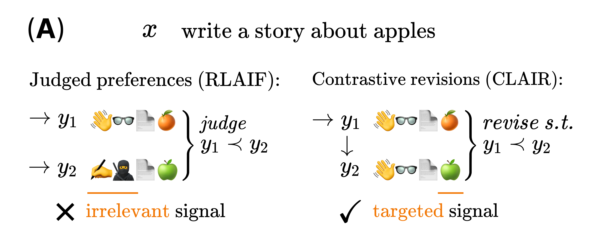

# Contrastive Learning From AI Revisions (CLAIR)

["Anchored Preference Optimization and Contrastive Revisions: Addressing Underspecification in Alignment"](https://huggingface.co/papers/2408.06266) introduces both Contrastive
Learning from AI Revisions (CLAIR), a data-creation method which leads to more contrastive preference pairs, and Anchored Preference Optimization (APO), a controllable and more stable alignment objective. While APO can be found in [TRL](https://huggingface.co/docs/trl/dpo_trainer#loss-functions), we have implemented a task for CLAIR in `distilabel`.

CLAIR is a method for creating preference pairs which minimally revises one output to express a preference, resulting in a more precise learning signal as opposed to conventional methods which use a judge to select a preferred response. 



The athors from the original paper shared a [collection of datasets from CLAIR and APO](https://huggingface.co/collections/ContextualAI/clair-and-apo-66b52868672bb1c984d1f3d5), where [ContextualAI/ultrafeedback_clair_32k](https://huggingface.co/datasets/ContextualAI/ultrafeedback_clair_32k) corresponds to the CLAIR implementation.

### Replication

!!! NOTE
    The section is named `Replication` but in this case we are showing how to use the [`CLAIR`][distilabel.steps.tasks.clair.CLAIR] task create revisions for your generations using `distilabel`.

To showcase CLAIR we will be using the [`CLAIR`][distilabel.steps.tasks.PrometheusEval] task implemented in `distilabel` and we are reusing a small sample of the already generated dataset by ContextualAI [`ContextualAI/ultrafeedback_clair_32k`](https://huggingface.co/datasets/ContextualAI/ultrafeedback_clair_32k) for testing.

#### Installation

To reproduce the code below, one will need to install `distilabel` as follows:

```bash
pip install "distilabel>=1.4.0"
```

Depending on the LLM provider you want to use, the requirements may vary, take a look at the dependencies in that case, we are using for the example the free inference endpoints from Hugging Face, but that won't apply for a bigger dataset.

#### Building blocks

In this case where we already have instructions and their generations, we will just need to load the data and the corresponding CLAIR task for the revisions:

- [`CLAIR`](https://distilabel.argilla.io/dev/components-gallery/tasks/clair/) to generate the revisions.

#### Code

Let's see the full pipeline applied to `ContextualAI/ultrafeedback_clair_32k` in `distilabel`:

```python
from typing import Any, Dict

from datasets import load_dataset

from distilabel.pipeline import Pipeline
from distilabel.steps.tasks import CLAIR
from distilabel.llms import InferenceEndpointsLLM


def transform_ultrafeedback(example: Dict[str, Any]) -> Dict[str, Any]:
    return {
        "task": example["prompt"],
        "student_solution": example["rejected"][1]["content"],
    }

dataset = (
    load_dataset("ContextualAI/ultrafeedback_clair_32k", split="train")
    .select(range(10))             # We collect just 10 examples
    .map(transform_ultrafeedback)  # Apply the transformation to get just the text
)

with Pipeline(name="CLAIR UltraFeedback sample") as pipeline:
    clair = CLAIR(  # (1)
        llm=InferenceEndpointsLLM(
            model_id="meta-llama/Meta-Llama-3.1-70B-Instruct",
            generation_kwargs={
                "temperature": 0.7,
                "max_new_tokens": 4096
            }
        )
    )


if __name__ == "__main__":
    distiset = pipeline.run(dataset=dataset)  # (2)
    distiset.push_to_hub(repo_id="username/clair-test", include_script=True)  # (3)
```

1. This Pipeline uses just CLAIR because we already have the generations, but one can just include a first task to create generations from instructions, and then the revisions with CLAIR.

2. Include the dataset directly in the run method for simplicity.

3. Push the distiset to the hub with the script for reproducibility.

An example dataset can be found at: [distilabel-internal-testing/clair-test](https://huggingface.co/datasets/distilabel-internal-testing/clair-test).
