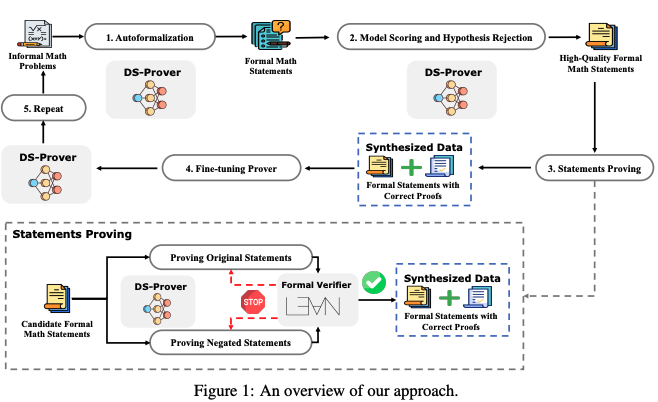

# DeepSeek Prover

["DeepSeek-Prover: Advancing Theorem Proving in LLMs through Large-Scale Synthetic Data"](https://arxiv.org/abs/2405.14333) presents an approach to generate mathematical proofs for theorems generated from informal math problems. This approach shows promising results to advance the capabilities of models towards theorem proving using synthetic data. Until this moment the dataset and the model trained on top of it haven't been opened, let's see how the approach works to reproduce the pipeline using `distilabel`. The following figure depicts the approach taken to generate the dataset:



The authors propose a method for generating [Lean 4](https://github.com/leanprover/lean4) proof data from informal mathematical problems. Their approach translates high-school and undergraduate-level mathematical competition problems into formal statements.

Here we show how to deal with steps 1 and 2, but the authors ensure the theorems are checked using the [lean4](https://github.com/leanprover/lean4) program on the generated proofs, and iterate for a series of steps, fine-tuning a model on the synthetic data (DeepSeek prover 7B), regenerating the dataset, and continue the process until no further improvement is found.

### Replication

!!! Note
    The section is named `Replication` but we will show how we can use `distilabel` to create the different steps outlined in the `DeepSeek-Prover` approach. We intentionally let some steps out of the pipeline, but this can easily be extended.

We will define the components needed to generate a dataset like the one depicted in the previous figure (we won't call lean4 or do the fine-tuning, this last step can be done outside of `distilabel`). The different blocks will have all the docstrings as we would have in the internal steps to showcase how they are done, but they can be omitted for brevity.

## Installation

To reproduce the code below, we need to install `distilabel` as it follows:

```bash
pip install "distilabel[hf-inference-endpoints]"
```

We have decided to use [`InferenceEndpointsLLM`](https://distilabel.argilla.io/latest/components-gallery/llms/inferenceendpointsllm/?h=inference#inferenceendpointsllm), but any other provider with a strong model could work.

## Building blocks

There are three components we needed to define for this pipeline, for the different components in the paper: A task to formalize the original statements, another one to assess the relevance of the theorems, and a final one to generate proofs for the theorems.

!!! Note

    We will use the same `LLM` for all the tasks, so we will define once and reuse it for the different tasks:
    
    ```python
    llm = InferenceEndpointsLLM(
        model_id="meta-llama/Meta-Llama-3-70B-Instruct",
    )
    ```

### DeepSeekProverAutoFormalization

This `Task` corresponds to the first step in the figure. Given an informal statement, it will formalize it for us in [`Lean 4`](https://github.com/leanprover/lean4) language, meaning it will translate from an informal statement that could be gathered from the internet, to the lean4 structured language.

<details close>
<summary>DeepSeekProverAutoFormalization</summary>

```python
_PARSE_DEEPSEEK_PROVER_AUTOFORMAL_REGEX = r"```lean4(.*?)```"

template_deepseek_prover_auto_formalization = """\
Mathematical Problem in Natural Language:
{{ informal_statement }}


Please use the following examples to guide you with the answer:

- {{ example }}

"""


class DeepSeekProverAutoFormalization(Task):
    examples: Optional[List[str]] = None
    system_prompt: str = "Translate the problem to Lean 4 (only the core declaration):\n```lean4\nformal statement goes here\n```"
    _template: Union[Template, None] = PrivateAttr(...)
    _few_shot: bool = PrivateAttr(default=False)

    def load(self) -> None:
        super().load()
        self._template = Template(template_deepseek_prover_auto_formalization)

    @property
    def inputs(self) -> List[str]:
        return ["informal_statement"]

    @property
    def outputs(self):
        return ["formal_statement", "model_name"]

    def format_input(self, input: str) -> ChatType:  # type: ignore
        return [
            {
                "role": "system",
                "content": self.system_prompt,
            },
            {
                "role": "user",
                "content": self._template.render(
                    informal_statement=input[self.inputs[0]],
                    few_shot=bool(self.examples),
                    examples=self.examples,
                ),
            },
        ]

    @override
    def format_output(  # type: ignore
        self, output: Union[str, None], input: Dict[str, Any] = None
    ) -> Dict[str, Any]:  # type: ignore
        match = re.search(_PARSE_DEEPSEEK_PROVER_AUTOFORMAL_REGEX, output, re.DOTALL)
        if match:
            match = match.group(1).strip()
        return {"formal_statement": match}
```

</details>

Following the paper, they found that the model yields better results if it uses examples in a few shot setting, so this class allows to take some examples to help in generating the formulation. Let's see an example of how we can instantiate it:

```python
from textwrap import dedent

examples = [
    dedent("""
    ## Statement in natural language:
    For real numbers k and x:
    If x is equal to (13 - √131) / 4, and
    If the equation 2x² - 13x + k = 0 is satisfied,
    Then k must be equal to 19/4.
    ## Formalized:
    theorem mathd_algebra_116 (k x : ℝ) (h₀ : x = (13 - Real.sqrt 131) / 4)
        (h₁ : 2 * x ^ 2 - 13 * x + k = 0) : k = 19 / 4 :="""),
    dedent("""
    ## Statement in natural language:
    The greatest common divisor (GCD) of 20 factorial (20!) and 200,000 is equal to 40,000.
    ## Formalized:
    theorem mathd_algebra_116 (k x : ℝ) (h₀ : x = (13 - Real.sqrt 131) / 4)
        (h₁ : 2 * x ^ 2 - 13 * x + k = 0) : k = 19 / 4 :="""),
    dedent("""
    ## Statement in natural language:
    Given two integers x and y:
    If y is positive (greater than 0),
    And y is less than x,
    And the equation x + y + xy = 80 is true,
    Then x must be equal to 26.
    ## Formalized:
    theorem mathd_algebra_116 (k x : ℝ) (h₀ : x = (13 - Real.sqrt 131) / 4)
        (h₁ : 2 * x ^ 2 - 13 * x + k = 0) : k = 19 / 4 :="""),
]

auto_formalization = DeepSeekProverAutoFormalization(
    name="auto_formalization",
    input_batch_size=8,
    llm=llm,
    examples=examples
)
```

### DeepSeekProverScorer

The next `Task` corresponds to the second step, the model scoring and assessment. It uses an LLM as judge to evaluate the relevance of the theorem, and assigns a score so it can be filtered afterwards.

<details close>
<summary>DeepSeekProverScorer</summary>

```python
template_deepseek_prover_scorer = """\
To evaluate whether a formal Lean4 statement will be of interest to the community, consider the following criteria:

1. Relevance to Current Research: Does the statement address a problem or concept that is actively being researched in mathematics or related fields? Higher relevance scores indicate greater potential interest.
2. Complexity and Depth: Is the statement complex enough to challenge existing theories and methodologies, yet deep enough to provide significant insights or advancements? Complexity and depth showcase Lean4's capabilities and attract interest.
3. Interdisciplinary Potential: Does the statement offer opportunities for interdisciplinary research, connecting mathematics with other fields such as computer science, physics, or biology? Interdisciplinary projects often garner wide interest.
4. Community Needs and Gaps: Does the statement fill an identified need or gap within the Lean4 community or the broader mathematical community? Addressing these needs directly correlates with interest.
5. Innovativeness: How innovative is the statement? Does it propose new methods, concepts, or applications? Innovation drives interest and engagement.

Customize your evaluation for each problem accordingly, assessing it as 'excellent', 'good', 'above average', 'fair' or 'poor'.

You should respond in the following format for each statement:

'''
Natural language: (Detailed explanation of the informal statement, including any relevant background information, assumptions, and definitions.)
Analysis: (Provide a brief justification for each score, highlighting why the statement scored as it did across the criteria.)
Assessment: (Based on the criteria, rate the statement as 'excellent', 'good', 'above average', 'fair' or 'poor'. JUST the Assessment.)
'''"""

class DeepSeekProverScorer(Task):
    _template: Union[Template, None] = PrivateAttr(...)

    def load(self) -> None:
        super().load()
        self._template = Template(template_deepseek_prover_scorer)

    @property
    def inputs(self) -> List[str]:
        return ["informal_statement", "formal_statement"]

    @property
    def outputs(self):
        return ["natural_language", "analysis", "assessment", "model_name"]

    def format_input(self, input: str) -> ChatType:
        return [
            {
                "role": "system",
                "content": self._template.render(),
            },
            {
                "role": "user",
                "content": f"## Informal statement:\n{input[self.inputs[0]]}\n\n ## Formal statement:\n{input[self.inputs[1]]}",
            },
        ]

    @override
    def format_output(
        self, output: Union[str, None], input: Dict[str, Any] = None
    ) -> Dict[str, Any]:
        try:
            result = output.split("Natural language:")[1].strip()
            natural_language, analysis = result.split("Analysis:")
            analysis, assessment = analysis.split("Assessment:")
            natural_language = natural_language.strip()
            analysis = analysis.strip()
            assessment = assessment.strip()
        except Exception:
            natural_language = analysis = assessment = None

        return {
            "natural_language": natural_language,
            "analysis": analysis,
            "assessment": assessment
        }

```

</details>

### DeepSeekProverSolver

The last task is in charge of generating a proof for the theorems generated in the previous steps.

<details close>
<summary>DeepSeekProverSolver</summary>

```python
class DeepSeekProverSolver(Task):
    system_prompt: str = (
        "You are an expert in proving mathematical theorems formalized in lean4 language. "
        "Your answers consist just in the proof to the theorem given, and nothing else."
    )

    @property
    def inputs(self) -> List[str]:
        return ["formal_statement"]

    @property
    def outputs(self):
        return ["proof"]

    def format_input(self, input: str) -> ChatType:
        prompt = dedent("""
            Give me a proof for the following theorem:
            ```lean4
            {theorem}
            ```"""
        )
        return [
            {
                "role": "system",
                "content": self.system_prompt,
            },
            {
                "role": "user",
                "content": prompt.format(theorem=input["formal_statement"]),
            },
        ]

    def format_output(
        self, output: Union[str, None], input: Dict[str, Any] = None
    ) -> Dict[str, Any]:
        import re
        match = re.search(_PARSE_DEEPSEEK_PROVER_AUTOFORMAL_REGEX, output, re.DOTALL)
        if match:
            match = match.group(1).strip()
        return {"proof": match}
```

</details>

Additionally, the original pipeline defined in the paper includes a step to check the final proofs using the lean 4 language that we have omitted for simplicity. The fine tuning can be done completely offline, and come back to the pipeline after each iteration/training run.

*All the docstrings have been removed from the code blocks, but can be seen in the full pipeline.*

## Code

Lets's put the building blocks together to create the final pipeline with `distilabel`. For this example we have generated a sample dataset [plaguss/informal-mathematical-statements-tiny](https://huggingface.co/datasets/plaguss/informal-mathematical-statements-tiny) of informal mathematical statements starting from [casey-martin/multilingual-mathematical-autoformalization](https://huggingface.co/datasets/casey-martin/multilingual-mathematical-autoformalization), but as the paper mentions, we can create formal statements and it's corresponding proofs starting from informal ones:

<details close>
<summary>Click to see the full pipeline</summary>

```python title="deepseek_prover.py"
--8<-- "examples/deepseek_prover.py"
```

</details>

The script can be run run for a dry run or not, depending on the argument (the pipeline will run without dry run by default), and will be pushed to the hub with the name `your_username/test_deepseek_prover`:

```bash
python deepseek_prover.py [-d | --dry-run | --no-dry-run]
```

Final dataset: [plaguss/test_deepseek_prover](https://huggingface.co/datasets/plaguss/test_deepseek_prover).
