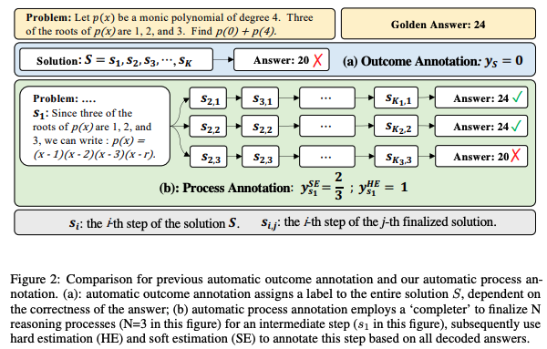

# Create datasets to train a Process Reward Model using Math-Shepherd

This example will introduce [Math-Shepherd: Verify and Reinforce LLMs Step-by-step without Human Annotations](https://arxiv.org/abs/2312.08935), an innovative math process reward model (PRM) which assigns reward scores to each step of math problem solutions. Specifically, we will present a recipe to create datasets to train such models. The final sections contain 2 pipeline examples to run the pipeline depending with more or less resources.

## Replica

Unlike traditional models that only look at final answers (Output Reward Models or ORM), this system evaluates each step of a mathematical solution and assigns reward scores to individual solution steps. Let's see the Figure 2 from the paper, which makes a summary of the labelling approach presented in their work.



In the traditional ORM approach, the annotation was done depending on the final outcome, while the Process Reward Model (PRM) allows labelling the different steps that lead to a solution, making for a richer set of information.

### Steps involved

- [`MathShepherdGenerator`](https://distilabel.argilla.io/dev/components-gallery/task/mathshepherdgenerator/): This step is in charge of generating solutions for the instruction. Depending on the value set for the `M`, this step can be used to generate both the `golden_solution`, to be used as a reference for the labeller, or the set of `solutions` to be labelled. For the `solutions` column we want some diversity, to allow the model to reach both good and bad solutions, so we have a representative sample for the labeller, so it may be better to use a "weaker" model.

- [`MathShepherdCompleter`](https://distilabel.argilla.io/dev/components-gallery/task/mathshepherdcompleter/). This task does the job of the `completer` in the paper, generating completions as presented in Figure 2, section 3.3.2. It doesn't generate a column on it's own, but updates the steps generated in the `solutions` column from the [`MathShepherdGenerator`](https://distilabel.argilla.io/dev/components-gallery/task/mathshepherdgenerator/), using as reference to label the data, the `golden_solution`. So in order for this step to work, we need both of this columns in our dataset. Depending on the type of dataset, we may already have access to the `golden_solution`, even if it's with a different name, but it's not the same for the `solutions`.

- [`FormatPRM`](https://distilabel.argilla.io/dev/components-gallery/task/formatprm/). This step does the auxiliary job of preparing the data to follow the format defined in the paper of having two columns `input` and `label`. After running the [`MathShepherdCompleter`](https://distilabel.argilla.io/dev/components-gallery/task/mathshepherdcompleter/), we have raw data that can be formatted as the user want. Using [`ExpandColumns`](https://distilabel.argilla.io/latest/components-gallery/steps/expandcolumns/) and this step, one can directly obtain the same format presented in the dataset shared in the paper: [peiyi9979/Math-Shepherd](https://huggingface.co/datasets/peiyi9979/Math-Shepherd?row=0).

## Data preparation

For this example, just as the original paper, we are using the [openai/gsm8k](https://huggingface.co/datasets/openai/gsm8k) dataset. We only need a dataset with instructions to be solved (in this case it corresponds to the `question` column), and we can generate everything else using our predefined steps.

## Building the pipeline

The pipeline uses `openai/gsm8k` as reference, but the pipeline can be applied to different datasets, keep in mind the prompts can be modified with the current definition, by tweaking the `extra_rules` and `few_shots` in each task:

```python
from datasets import load_dataset

from distilabel.steps.tasks import MathShepherdCompleter, MathShepherdGenerator, FormatPRM
from distilabel.models import InferenceEndpointsLLM
from distilabel.pipeline import Pipeline
from distilabel.steps import CombineOutputs, ExpandColumns

ds_name = "openai/gsm8k"

ds = load_dataset(ds_name, "main", split="test").rename_column("question", "instruction").select(range(3))  # (1)

with Pipeline(name="Math-Shepherd") as pipe:
    model_id_70B = "meta-llama/Meta-Llama-3.1-70B-Instruct"
    model_id_8B = "meta-llama/Meta-Llama-3.1-8B-Instruct"

    llm_70B = InferenceEndpointsLLM(
        model_id=model_id_70B,
        tokenizer_id=model_id_70B,
        generation_kwargs={"max_new_tokens": 1024, "temperature": 0.6},
    )
    llm_8B = InferenceEndpointsLLM(
        model_id=model_id_8B,
        tokenizer_id=model_id_8B,
        generation_kwargs={"max_new_tokens": 2048, "temperature": 0.6},
    )  # (2)

    generator_golden = MathShepherdGenerator(
        name="golden_generator",
        llm=llm_70B,
    )  # (3)
    generator = MathShepherdGenerator(
        name="generator",
        llm=llm_8B,
        M=5
    )  # (4)
    completer = MathShepherdCompleter(
        name="completer",
        llm=llm_8B,
        N=4
    )  # (5)

    combine = CombineOutputs()

    expand = ExpandColumns(
        name="expand_columns",
        columns=["solutions"],
        split_statistics=True,
    )  # (6)
    formatter = FormatPRM(name="format_prm")  # (7)

    [generator_golden, generator] >> combine >> completer >> expand >> formatter # (8)
```

1. Will use just 3 rows from the sample dataset, and rename the "question" to "instruction", to set the expected value for the [`MathShepherdGenerator`](https://distilabel.argilla.io/dev/components-gallery/task/mathshepherdgenerator/).

2. We will use 2 different LLMs, `meta-llama/Meta-Llama-3.1-70B-Instruct` (a stronger model for the `golden_solution`) and `meta-llama/Meta-Llama-3.1-8B-Instruct` (a weaker one to generate candidate solutions, and the completions).

3. This [`MathShepherdGenerator`](https://distilabel.argilla.io/dev/components-gallery/task/mathshepherdgenerator/) task, that uses the *stronger* model, will generate the `golden_solution` for us, the step by step solution for the task.

4. Another [`MathShepherdGenerator`](https://distilabel.argilla.io/dev/components-gallery/task/mathshepherdgenerator/) task, but in this case using the *weaker* model will generate candidate `solutions` (`M=5` in total).

5. Now the [`MathShepherdCompleter`](https://distilabel.argilla.io/dev/components-gallery/task/mathshepherdcompleter/) task will generate `n=4` *completions* for each step of each candidate solution in the `solutions` column, and label them using the `golden_solution` as shown in Figure 2 in the paper. This step will add the label (it uses [+ and -] tags following the implementation in the paper, but these values can be modified) to the `solutions` column in place, instead of generating an additional column, but the intermediate completions won't be shown at the end.

6. The [`ExpandColumns`](https://distilabel.argilla.io/latest/components-gallery/steps/expandcolumns/) step expands the solution to match the instruction, so if we had set M=5, we would now have 5x instruction-pair solutions. We set the `split_statistics` to True to ensure the `distilabel_metadata` is split accordingly, othwerwise the number of tokens for each solution would count as the tokens needed for the whole list of solutions generated. One can omit both this and the following step and process the data for training as preferred.

7. And finally, the [`FormatPRM`](https://distilabel.argilla.io/dev/components-gallery/task/formatprm/) generates two columns: `input` and `label` which prepare the data for training as presented in the original Math-Shepherd dataset.

8. Both the `generator_golden` and `generator` can be run in parallel as there's no dependency between them, and after that we combine the results and pass them to the `completer`. Finally, we use the `expand` and `formatter` prepare the data in the expected format to train the Process Reward Model as defined in the original paper.

## Script and final dataset

To see all the pieces in place, take a look at the full pipeline:

??? Run

    ```python
    python examples/pipe_math_shepherd.py
    ```

??? "Full pipeline"

    ```python title="pipe_math_shepherd.py"
    --8<-- "examples/pipe_math_shepherd.py"
    ```

    The resulting dataset can be seen at: [plaguss/test_math_shepherd_prm](https://huggingface.co/datasets/plaguss/test_math_shepherd_prm).

### Pipeline with vLLM and ray

This section contains an alternative way of running the pipeline with a bigger outcome. To showcase how to scale the pipeline, we are using for the 3 generating tasks [Qwen/Qwen2.5-72B-Instruct](https://huggingface.co/Qwen/Qwen2.5-72B-Instruct), highly improving the final quality as it follows much closer the prompt given. Also, we are using `vLLM` and 3 nodes (one per task in this case), to scale up the generation process.

??? Tip "Math-Shepherd's bigger pipeline"

    ````python
    from datasets import load_dataset

    from distilabel.models import vLLM
    from distilabel.steps import StepResources
    from distilabel.pipeline import Pipeline
    from distilabel.steps import CombineOutputs, ExpandColumns
    from distilabel.steps.tasks import (
        FormatPRM,
        MathShepherdCompleter,
        MathShepherdGenerator,
    )

    ds_name = "openai/gsm8k"

    ds = (
        load_dataset(ds_name, "main", split="test")
        .rename_column("question", "instruction")
    )


    with Pipeline(name="Math-Shepherd").ray() as pipe:  # (1)

        model_id_72B = "Qwen/Qwen2.5-72B-Instruct"

        llm_72B = vLLM(
            model=model_id_72B,
            tokenizer=model_id_72B,
            extra_kwargs={
                "tensor_parallel_size": 8,               # Number of GPUs per node
                "max_model_len": 2048,
            },
            generation_kwargs={
                "temperature": 0.5,
                "max_new_tokens": 4096,
            },
        )

        generator_golden = MathShepherdGenerator(
            name="golden_generator",
            llm=llm_72B,
            input_batch_size=50,
            output_mappings={"model_name": "model_name_golden_generator"},
            resources=StepResources(replicas=1, gpus=8)  # (2)
        )
        generator = MathShepherdGenerator(
            name="generator",
            llm=llm_72B,
            input_batch_size=50,
            M=5,
            use_default_structured_output=True,
            output_mappings={"model_name": "model_name_generator"},
            resources=StepResources(replicas=1, gpus=8)
        )
        completer = MathShepherdCompleter(
            name="completer", 
            llm=llm_72B,
            N=8,
            use_default_structured_output=True,
            output_mappings={"model_name": "model_name_completer"},
            resources=StepResources(replicas=1, gpus=8)
        )

        combine = CombineOutputs()

        expand = ExpandColumns(
            name="expand_columns",
            columns=["solutions"],
            split_statistics=True,

        )
        formatter = FormatPRM(name="format_prm", format="trl")  # (3)

        [generator_golden, generator] >> combine >> completer >> expand >> formatter


    if __name__ == "__main__":
        distiset = pipe.run(use_cache=False, dataset=ds, dataset_batch_size=50)
        if distiset:
            distiset.push_to_hub("plaguss/test_math_shepherd_prm_ray")

    ````

    1. Transform the pipeline to run using `ray` backend.

    2. Assign the resources: number of replicas 1 as we want a single instance of the task in a node, and number of GPUs equals to 8, using a whole node. Given that we defined the script in the slurm file to use 3 nodes, this will use all the 3 available nodes, with 8 GPUs for each of these tasks.

    3. Prepare the columns in the format expected by `TRL` for training.

Click to see the slurm file used to run the previous pipeline. It's our go to `slurm` file, using 3 8xH100 nodes.

??? Tip "Slurm file"

    ```bash
    #!/bin/bash
    #SBATCH --job-name=math-shepherd-test-ray
    #SBATCH --partition=hopper-prod
    #SBATCH --qos=normal
    #SBATCH --nodes=3
    #SBATCH --exclusive
    #SBATCH --ntasks-per-node=1
    #SBATCH --gpus-per-node=8
    #SBATCH --output=./logs/%x-%j.out
    #SBATCH --err=./logs/%x-%j.err
    #SBATCH --time=48:00:00

    set -ex

    module load cuda/12.1

    echo "SLURM_JOB_ID: $SLURM_JOB_ID"
    echo "SLURM_JOB_NODELIST: $SLURM_JOB_NODELIST"

    source .venv/bin/activate

    # Getting the node names
    nodes=$(scontrol show hostnames "$SLURM_JOB_NODELIST")
    nodes_array=($nodes)

    # Get the IP address of the head node
    head_node=${nodes_array[0]}
    head_node_ip=$(srun --nodes=1 --ntasks=1 -w "$head_node" hostname --ip-address)

    # Start Ray head node
    port=6379
    ip_head=$head_node_ip:$port
    export ip_head
    echo "IP Head: $ip_head"

    # Generate a unique Ray tmp dir for the head node
    head_tmp_dir="/tmp/ray_tmp_${SLURM_JOB_ID}_head"

    echo "Starting HEAD at $head_node"
    srun --nodes=1 --ntasks=1 -w "$head_node" \
        ray start --head --node-ip-address="$head_node_ip" --port=$port \
        --dashboard-host=0.0.0.0 \
        --dashboard-port=8265 \
        --temp-dir="$head_tmp_dir" \
        --block &

    # Give some time to head node to start...
    sleep 10

    # Start Ray worker nodes
    worker_num=$((SLURM_JOB_NUM_NODES - 1))

    # Start from 1 (0 is head node)
    for ((i = 1; i <= worker_num; i++)); do
        node_i=${nodes_array[$i]}
        worker_tmp_dir="/tmp/ray_tmp_${SLURM_JOB_ID}_worker_$i"
        echo "Starting WORKER $i at $node_i"
        srun --nodes=1 --ntasks=1 -w "$node_i" \
            ray start --address "$ip_head" \
            --temp-dir="$worker_tmp_dir" \
            --block &
        sleep 5
    done

    # Give some time to the Ray cluster to gather info
    sleep 60

    # Finally submit the job to the cluster
    RAY_ADDRESS="http://$head_node_ip:8265" ray job submit --working-dir pipeline -- python -u pipeline_math_shepherd_ray.py
    ```

??? Tip "Final dataset"

    The resulting dataset can be seen at: [plaguss/test_math_shepherd_prm_ray](https://huggingface.co/datasets/plaguss/test_math_shepherd_prm_ray).

