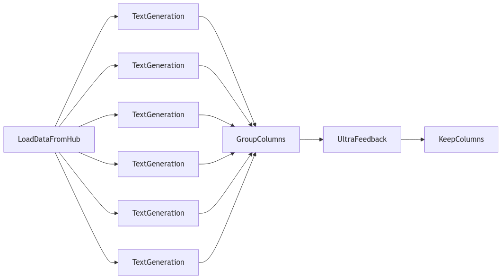

# UltraFeedback

[UltraFeedback: Boosting Language Models with High-quality Feedback](https://arxiv.org/abs/2310.01377) is a paper published by [OpenBMB](https://www.openbmb.cn/home) which proposes `UltraFeedback`, a large-scale, fine-grained, diverse preference dataset, used for training powerful reward models and critic models.

UltraFeedback collects about 64k prompts from diverse resources (including UltraChat, ShareGPT, Evol-Instruct, TruthfulQA, FalseQA, and FLAN), then they use these prompts to query multiple LLMs (commercial models, Llama models ranging 7B to 70B, and non-Llama models) and generate four different responses for each prompt, resulting in a total of 256k samples i.e. the UltraFeedback will rate four responses on every OpenAI request.



To collect high-quality preference and textual feedback, they design a fine-grained annotation instruction, which contains four different aspects, namely instruction-following, truthfulness, honesty and helpfulness (even though within the paper they also mention a fifth one named verbalized calibration). Finally, GPT-4 is used to generate the ratings for the generated responses to the given prompt using the previously mentioned aspects.

## Replication

To replicate the paper we will be using `distilabel` and a smaller dataset created by the Hugging Face H4 team named [`HuggingFaceH4/instruction-dataset`](https://huggingface.co/datasets/HuggingFaceH4/instruction-dataset) for testing purposes.

Also for testing purposes we will just show how to evaluate the generated responses for a given prompt using a new global aspect named `overall-rating` defined by Argilla, that computes the average of the four aspects, so as to reduce number of requests to be sent to OpenAI, but note that all the aspects are implemented within `distilabel` and can be used instead for a more faithful reproduction. Besides that we will generate three responses for each instruction using three LLMs selected from a pool of six: [`HuggingFaceH4/zephyr-7b-beta`](https://huggingface.co/HuggingFaceH4/zephyr-7b-beta), [`argilla/notus-7b-v1`](https://huggingface.co/argilla/notus-7b-v1), [`google/gemma-1.1-7b-it`](https://huggingface.co/google/gemma-1.1-7b-it), [`meta-llama/Meta-Llama-3-8B-Instruct`](https://huggingface.co/meta-llama/Meta-Llama-3-8B-Instruct), [`HuggingFaceH4/zephyr-7b-gemma-v0.1`](https://huggingface.co/HuggingFaceH4/zephyr-7b-gemma-v0.1) and [`mlabonne/UltraMerge-7B`](https://huggingface.co/mlabonne/UltraMerge-7B).

### Installation

To replicate UltraFeedback one will need to install `distilabel` as it follows:

```bash
pip install "distilabel[argilla,openai,vllm]>=1.0.0"
```

And since we will be using `vllm` we will need to use a VM with at least 6 NVIDIA GPUs with at least 16GB of memory each to run the text generation, and set the `OPENAI_API_KEY` environment variable value.

### Building blocks

- [`LoadDataFromHub`][distilabel.steps.LoadDataFromHub]: Generator Step to load a dataset from the Hugging Face Hub.
- [`sample_n_steps`][distilabel.pipeline.sample_n_steps]: Function to create a `routing_batch_function` that samples `n` downstream steps for each batch generated by the upstream step. This is the key to replicate the LLM pooling mechanism described in the paper.
- [`TextGeneration`][distilabel.steps.tasks.TextGeneration]: Task to generate responses for a given instruction using an LLM.
    - [`vLLM`][distilabel.models.vLLM]: LLM that loads a model from the Hugging Face Hub using `vllm`.
- [`GroupColumns`][distilabel.steps.GroupColumns]: Task that combines multiple columns into a single one i.e. from string to list of strings. Useful when there are multiple parallel steps that are connected to the same node.
- [`UltraFeedback`][distilabel.steps.tasks.UltraFeedback]: Task that generates ratings for the responses of a given instruction using the UltraFeedback prompt.
    - [`OpenAILLM`][distilabel.models.OpenAILLM]: LLM that loads a model from OpenAI.
- [`KeepColumns`][distilabel.steps.KeepColumns]: Task to keep the desired columns while removing the not needed ones, as well as defining the order for those.
- (optional) [`PreferenceToArgilla`][distilabel.steps.PreferenceToArgilla]: Task to optionally push the generated dataset to Argilla to do some further analysis and human annotation.

### Code

As mentioned before, we will put the previously mentioned building blocks together to replicate UltraFeedback.

```python
from distilabel.models import OpenAILLM, vLLM
from distilabel.pipeline import Pipeline, sample_n_steps
from distilabel.steps import (
    GroupColumns,
    KeepColumns,
    LoadDataFromHub,
    PreferenceToArgilla,
)
from distilabel.steps.tasks import TextGeneration, UltraFeedback

sample_three_llms = sample_n_steps(n=3)


with Pipeline(name="ultrafeedback-pipeline") as pipeline:
    load_hub_dataset = LoadDataFromHub(
        name="load_dataset",
        output_mappings={"prompt": "instruction"},
        batch_size=2,
    )

    text_generation_with_notus = TextGeneration(
        name="text_generation_with_notus",
        llm=vLLM(model="argilla/notus-7b-v1"),
        input_batch_size=2,
        output_mappings={"model_name": "generation_model"},
    )
    text_generation_with_zephyr = TextGeneration(
        name="text_generation_with_zephyr",
        llm=vLLM(model="HuggingFaceH4/zephyr-7b-gemma-v0.1"),
        input_batch_size=2,
        output_mappings={"model_name": "generation_model"},
    )
    text_generation_with_gemma = TextGeneration(
        name="text_generation_with_gemma",
        llm=vLLM(model="google/gemma-1.1-7b-it"),
        input_batch_size=2,
        output_mappings={"model_name": "generation_model"},
    )
    text_generation_with_zephyr_gemma = TextGeneration(
        name="text_generation_with_zephyr_gemma",
        llm=vLLM(model="HuggingFaceH4/zephyr-7b-gemma-v0.1"),
        input_batch_size=2,
        output_mappings={"model_name": "generation_model"},
    )
    text_generation_with_llama = TextGeneration(
        name="text_generation_with_llama",
        llm=vLLM(model="meta-llama/Meta-Llama-3-8B-Instruct"),
        input_batch_size=2,
        output_mappings={"model_name": "generation_model"},
    )
    text_generation_with_ultramerge = TextGeneration(
        name="text_generation_with_ultramerge",
        llm=vLLM(model="mlabonne/UltraMerge-7B"),
        input_batch_size=2,
        output_mappings={"model_name": "generation_model"},
    )

    combine_columns = GroupColumns(
        name="combine_columns",
        columns=["generation", "generation_model"],
        output_columns=["generations", "generation_models"],
        input_batch_size=2
    )

    ultrafeedback = UltraFeedback(
        name="ultrafeedback_openai",
        llm=OpenAILLM(model="gpt-4-turbo-2024-04-09"),
        aspect="overall-rating",
        output_mappings={"model_name": "ultrafeedback_model"},
    )

    keep_columns = KeepColumns(
        name="keep_columns",
        columns=[
            "instruction",
            "generations",
            "generation_models",
            "ratings",
            "rationales",
            "ultrafeedback_model",
        ],
    )

    (
        load_hub_dataset
        >> sample_three_llms
        >> [
            text_generation_with_notus,
            text_generation_with_zephyr,
            text_generation_with_gemma,
            text_generation_with_llama,
            text_generation_with_zephyr_gemma,
            text_generation_with_ultramerge
        ]
        >> combine_columns
        >> ultrafeedback
        >> keep_columns
    )

    # Optional: Push the generated dataset to Argilla, but will need to `pip install argilla` first
    # push_to_argilla = PreferenceToArgilla(
    #     name="push_to_argilla",
    #     api_url="<ARGILLA_API_URL>",
    #     api_key="<ARGILLA_API_KEY>",  # type: ignore
    #     dataset_name="ultrafeedback",
    #     dataset_workspace="admin",
    #     num_generations=2,
    # )
    # keep_columns >> push_to_argilla
```

!!! NOTE
    As we're using a relative small dataset, we're setting a low `batch_size` and `input_batch_size` so we have more batches for the `routing_batch_function` i.e. we will have more variety on the LLMs used to generate the responses. When using a large dataset, it's recommended to use a larger `batch_size` and `input_batch_size` to benefit from the `vLLM` optimizations for larger batch sizes, which makes the pipeline execution faster.

Then we need to call `pipeline.run` with the runtime parameters so that the pipeline can be launched.

```python
distiset = pipeline.run(
    parameters={
        load_hub_dataset.name: {
            "repo_id": "HuggingFaceH4/instruction-dataset",
            "split": "test",
        },
        text_generation_with_notus.name: {
            "llm": {
                "generation_kwargs": {
                    "max_new_tokens": 512,
                    "temperature": 0.7,
                }
            },
        },
        text_generation_with_zephyr.name: {
            "llm": {
                "generation_kwargs": {
                    "max_new_tokens": 512,
                    "temperature": 0.7,
                }
            },
        },
        text_generation_with_gemma.name: {
            "llm": {
                "generation_kwargs": {
                    "max_new_tokens": 512,
                    "temperature": 0.7,
                }
            },
        },
        text_generation_with_llama.name: {
            "llm": {
                "generation_kwargs": {
                    "max_new_tokens": 512,
                    "temperature": 0.7,
                }
            },
        },
        text_generation_with_zephyr_gemma.name: {
            "llm": {
                "generation_kwargs": {
                    "max_new_tokens": 512,
                    "temperature": 0.7,
                }
            },
        },
        text_generation_with_ultramerge.name: {
            "llm": {
                "generation_kwargs": {
                    "max_new_tokens": 512,
                    "temperature": 0.7,
                }
            },
        },
        ultrafeedback.name: {
            "llm": {
                "generation_kwargs": {
                    "max_new_tokens": 2048,
                    "temperature": 0.7,
                }
            },
        },
    }
)
```

Finally, we can optionally push the generated dataset, named [`Distiset`][distilabel.distiset.Distiset], to the Hugging Face Hub via the `push_to_hub` method, so that each subset generated in the leaf steps is pushed to the Hub.

```python
distiset.push_to_hub(
    "ultrafeedback-instruction-dataset",
    private=True,
)
```
