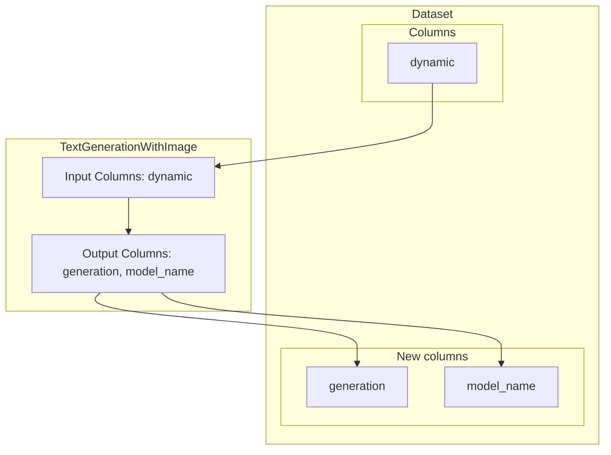

---
hide:
  - navigation
---
# TextGenerationWithImage

Text generation with images with an `LLM` given a prompt.


`TextGenerationWithImage` is a pre-defined task that allows passing a custom prompt using the
    Jinja2 syntax. By default, a `instruction` is expected in the inputs, but the using
    `template` and `columns` attributes one can define a custom prompt and columns expected
    from the text. Additionally, an `image` column is expected containing one of the
    url, base64 encoded image or PIL image. This task inherits from `TextGeneration`,
    so all the functionality available in that task related to the prompt will be available
    here too.


### Attributes

- **system_prompt**: The system prompt to use in the generation.  If not, then no system prompt will be used. Defaults to `None`.

- **template**: The template to use for the generation. It must follow the Jinja2 template  syntax. If not provided, it will assume the text passed is an instruction and  construct the appropriate template.

- **columns**: A string with the column, or a list with columns expected in the template.  Take a look at the examples for more information. Defaults to `instruction`.

- **image_type**: The type of the image provided, this will be used to preprocess if necessary.  Must be one of "url", "base64" or "PIL".


### Input & Output Columns




#### Inputs


- **dynamic** (determined by `columns` attribute): By default will be set to `instruction`.  The columns can point both to a `str` or a `list[str]` to be used in the template.


#### Outputs


- **generation** (`str`): The generated text.

- **model_name** (`str`): The name of the model used to generate the text.


### Examples


#### Answer questions from an image
```python
from distilabel.steps.tasks import TextGenerationWithImage
from distilabel.models.llms import InferenceEndpointsLLM

vision = TextGenerationWithImage(
    name="vision_gen",
    llm=InferenceEndpointsLLM(
        model_id="meta-llama/Llama-3.2-11B-Vision-Instruct",
    ),
    image_type="url"
)

vision.load()

result = next(
    vision.process(
        [
            {
                "instruction": "What’s in this image?",
                "image": "https://upload.wikimedia.org/wikipedia/commons/thumb/d/dd/Gfp-wisconsin-madison-the-nature-boardwalk.jpg/2560px-Gfp-wisconsin-madison-the-nature-boardwalk.jpg"
            }
        ]
    )
)
# result
# [
#     {
#         "instruction": "What’s in this image?",
#         "image": "https://upload.wikimedia.org/wikipedia/commons/thumb/d/dd/Gfp-wisconsin-madison-the-nature-boardwalk.jpg/2560px-Gfp-wisconsin-madison-the-nature-boardwalk.jpg",
#         "generation": "Based on the visual cues in the image...",
#         "model_name": "meta-llama/Llama-3.2-11B-Vision-Instruct"
#         ... # distilabel_metadata would be here
#     }
# ]
# result[0]["generation"]
# "Based on the visual cues in the image, here are some possible story points:

* The image features a wooden boardwalk leading through a lush grass field, possibly in a park or nature reserve.

Analysis and Ideas:
* The abundance of green grass and trees suggests a healthy ecosystem or habitat.
* The presence of wildlife, such as birds or deer, is possible based on the surroundings.
* A footbridge or a pathway might be a common feature in this area, providing access to nearby attractions or points of interest.

Additional Questions to Ask:
* Why is a footbridge present in this area?
* What kind of wildlife inhabits this region"
```

#### Answer questions from an image stored as base64
```python
# For this example we will assume that we have the string representation of the image
# stored, but will just take the image and transform it to base64 to ilustrate the example.
import requests
import base64

image_url ="https://cdn.britannica.com/61/93061-050-99147DCE/Statue-of-Liberty-Island-New-York-Bay.jpg"
img = requests.get(image_url).content
base64_image = base64.b64encode(img).decode("utf-8")

from distilabel.steps.tasks import TextGenerationWithImage
from distilabel.models.llms import InferenceEndpointsLLM

vision = TextGenerationWithImage(
    name="vision_gen",
    llm=InferenceEndpointsLLM(
        model_id="meta-llama/Llama-3.2-11B-Vision-Instruct",
    ),
    image_type="base64"
)

vision.load()

result = next(
    vision.process(
        [
            {
                "instruction": "What’s in this image?",
                "image": base64_image
            }
        ]
    )
)
```


### References

- [Jinja2 Template Designer Documentation](https://jinja.palletsprojects.com/en/3.1.x/templates/)

- [Image-Text-to-Text](https://huggingface.co/tasks/image-text-to-text)

- [OpenAI Vision](https://platform.openai.com/docs/guides/vision)


