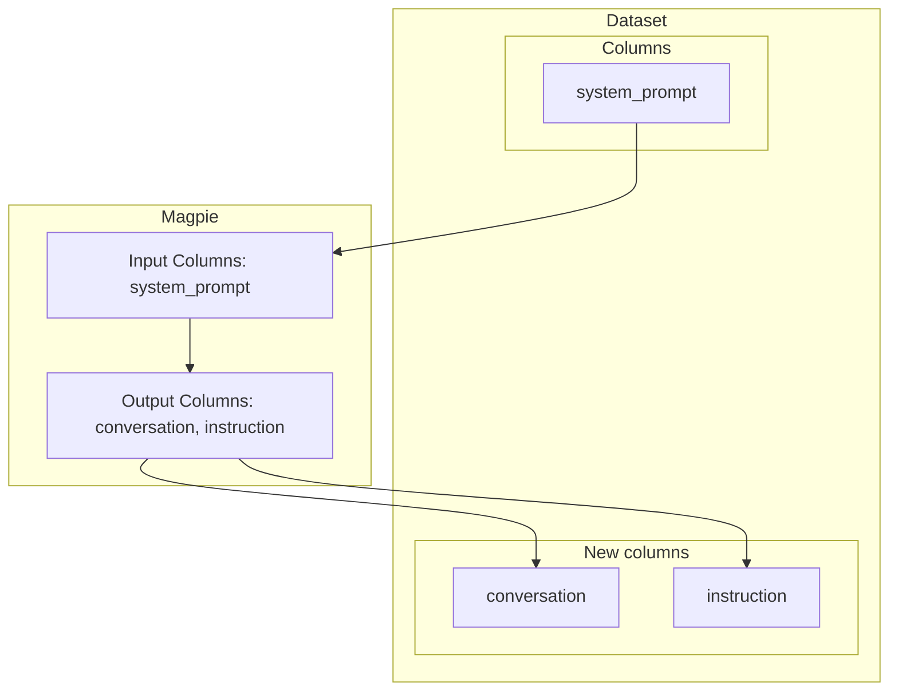

---
hide:
  - navigation
---
# Magpie

Generates conversations using an instruct fine-tuned LLM.

Magpie is a neat method that allows generating user instructions with no seed data
    or specific system prompt thanks to the autoregressive capabilities of the instruct
    fine-tuned LLMs. As they were fine-tuned using a chat template composed by a user message
    and a desired assistant output, the instruct fine-tuned LLM learns that after the pre-query
    or pre-instruct tokens comes an instruction. If these pre-query tokens are sent to the
    LLM without any user message, then the LLM will continue generating tokens as it was
    the user. This trick allows "extracting" instructions from the instruct fine-tuned LLM.
    After this instruct is generated, it can be sent again to the LLM to generate this time
    an assistant response. This process can be repeated N times allowing to build a multi-turn
    conversation. This method was described in the paper 'Magpie: Alignment Data Synthesis from
    Scratch by Prompting Aligned LLMs with Nothing'.

    

### Attributes

- **n_turns**: the number of turns that the generated conversation will have.

- **only_instruction**: whether to generate only the instruction. If this argument is  `True`, then `n_turns` will be ignored. Defaults to `False`.

- **system_prompt**: an optional system prompt that can be used to steer the LLM to generate  content of certain topic, guide the style, etc. If the provided inputs contains  a `system_prompt` column, then this runtime parameter will be ignored and the  one from the column will be used. Defaults to `None`.

### Runtime Parameters

- **n_turns**: the number of turns that the generated conversation will have.  only_instruction: whether to generate only the instruction. If this argument is  `True`, then `n_turns` will be ignored. Defaults to `False`.

- **system_prompt**: an optional system prompt that can be used to steer the LLM to  generate content of certain topic, guide the style, etc. If the provided inputs  contains a `system_prompt` column, then this runtime parameter will be ignored  and the one from the column will be used. Defaults to `None`.

### Input & Output Columns

#### Inputs

- **system_prompt** (`str`, optional): an optional system prompt that can be provided  to guide the generation of the instruct LLM and steer it to generate instructions  of certain topic.

#### Outputs

- **conversation** (`ChatType`): the generated conversation which is a list of chat  items with a role and a message. Only if `only_instructions=False`.

- **instruction** (`str`): the generated instructions if `only_instruction=True`.

### References

- [Magpie: Alignment Data Synthesis from Scratch by Prompting Aligned LLMs with Nothing](https://arxiv.org/abs/2406.08464)

